# 系统架构

# PitWall Agent

---

## 文档信息

| 项目 | 内容 |
|------|------|
| 文档名称 | 系统架构 |
| 版本号 | 1.0 |
| 状态 | 架构冻结 V1 |
| 项目名称 | PitWall Agent |
| 目标读者 | 软件工程师、AI 工程师、架构师 |
| 相关文档 | 项目概述、产品需求文档、RFC 系列 |

---

# 第 1 章 引言

## 1.1 目的

本文档描述 PitWall Agent 的整体软件架构。

它定义了系统的结构组织、每个模块的职责、组件之间的交互以及指导实现的架构原则。

与描述系统**应该做什么**的产品需求文档不同，本文档解释系统**如何组织**以实现这些需求。

本文所述架构将作为后续所有实现工作和架构 RFC 的基础。

---

## 1.2 范围

本文档涵盖完整的 PitWall Agent 平台架构，包括：

- 前端架构
- 后端架构
- Agent 运行时
- 工具框架
- 知识检索
- 数据持久化
- 后台服务
- 部署架构
- 外部集成

详细的实现决策在 RFC 文档中单独说明。

---

## 1.3 设计目标

架构围绕以下目标设计。

### 可扩展性

系统应支持未来的功能扩展，而无需进行重大架构变更。

新能力应通过模块化扩展引入，而非修改现有组件。

---

### 可维护性

每个模块应具有明确定义的职责。

业务逻辑应独立于基础设施细节。

代码库应能让不熟悉项目的开发人员易于理解。

---

### 可靠性

外部服务故障不应导致整个应用失效。

系统应尽可能优雅降级。

---

### 可扩展性（可插拔性）

新工具、检索方法、数据源和语言模型的集成应尽量少改动现有架构。

---

### 可测试性

每个主要组件都应可独立测试。

单元测试、集成测试和端到端测试都应得到支持。

---

### 生产就绪性

架构应支持在真实生产环境中部署。

这包括：

- 配置管理
- 日志记录
- 监控
- 容器化
- 持续集成
- 持续部署

---

# 第 2 章 架构原则

PitWall Agent 的架构遵循若干核心原则。

这些原则指导项目中的每个实现决策。

---

## 2.1 分层架构

PitWall Agent 采用分层架构。

每一层仅与相邻层通信，并暴露明确定义的接口。

这种分离降低了耦合度，提高了可维护性。

主要层包括：

- 表示层
- 应用层
- Agent 运行时
- 工具层
- 知识层
- 基础设施层

每一层具有单一职责，不应直接访问其预期范围之外的组件。

---

## 2.2 关注点分离

职责根据业务功能进行分离。

示例包括：

前端

- 用户交互
- 渲染
- 流式输出

后端

- 请求处理
- 会话管理
- 服务编排

Agent 运行时

- 推理
- 规划
- 工具选择

知识层

- 文档检索
- 嵌入
- 向量搜索

基础设施

- 数据库
- 缓存
- 对象存储
- 外部服务

任何层都不应承担属于其他层的职责。

---

## 2.3 单 Agent 架构

PitWall Agent 使用单个智能 Agent 运行时。

系统不创建多个自治 Agent，而是将领域特定任务委托给专门的工具。

这种方法具有以下优点：

- 更低的复杂度
- 更易调试
- 可预测的执行流程
- 更简单的状态管理
- 更好的可维护性

Agent 运行时负责规划和编排，而非领域特定实现。

---

## 2.4 面向工具的设计

每个外部能力都封装为一个工具。

示例包括：

- 新闻工具
- 赛事工具
- 规则工具
- 策略工具

每个工具向 Agent 运行时暴露稳定接口。

内部实现细节隐藏在工具抽象之后。

这使得 API 或提供者的变更不会影响 Agent 逻辑。

---

## 2.5 检索在先，生成在后

当需要事实性知识时，应在调用语言模型之前先检索外部信息。

语言模型应基于检索到的证据进行推理，而非仅依赖预训练知识。

这一原则显著提高了事实准确性，减少了幻觉。

---

## 2.6 面向服务的后端

业务逻辑实现在应用服务中。

Agent 运行时被视为后端中的一个服务，而非后端本身。

典型服务包括：

- 聊天服务
- 新闻服务
- 赛事服务
- 知识服务
- 会话服务
- 调度服务

这种分离便于测试和未来向分布式架构迁移。

---

## 2.7 配置优先

环境特定值绝不能硬编码。

配置应通过以下方式提供：

- 环境变量
- 配置文件
- 密钥管理系统

示例包括：

- 数据库 URL
- API 密钥
- 模型名称
- 向量数据库端点

---

## 2.8 可观测性

系统应暴露足够的运行时信息，以便调试和监控。

可观测性包括：

- 结构化日志
- 请求追踪
- Agent 执行记录
- 工具执行日志
- 性能指标

运维可见性被视为核心架构需求，而非可选特性。

---

## 2.9 松耦合

模块通过定义良好的接口通信。

替换一个实现不应要求更改不相关的模块。

示例包括：

- 替换 LLM 提供者
- 切换向量数据库
- 更换嵌入模型
- 引入新检索策略

架构应尽量减少业务模块之间的直接依赖。

---

## 2.10 未来演进

尽管版本 1.0 聚焦于单个 Agent 运行时，架构应允许未来扩展。

潜在未来方向包括：

- 额外工具
- 多模态能力
- 分布式部署
- 多知识库
- 其他 AI 模型
- 企业认证

当前架构有意为这些未来增强留出空间，无需根本性重新设计。

---

**第 1–2 章结束**

# 第 3 章 整体架构

## 3.1 架构概览

PitWall Agent 采用分层架构，围绕单个智能 Agent 运行时设计。

系统不允许语言模型直接访问外部资源，而是将每个外部能力封装为工具。业务逻辑通过应用服务实现，而基础设施关注点与推理工作流保持隔离。

架构强调：

- 高内聚
- 低耦合
- 模块化组件
- 生产就绪性
- 可扩展性

Agent 运行时充当系统的推理引擎，但不拥有业务逻辑或基础设施访问权。

---

## 3.2 高层架构

```
                                    用户
                                      │
                                      ▼
                           Next.js Web 应用程序
                                      │
                              HTTP / WebSocket
                                      │
                                      ▼
                                 FastAPI API
                                      │
                                      ▼
                          应用服务层
        ┌────────────────────────────────────────────────────┐
        │                                                    │
        │  聊天服务                                          │
        │  新闻服务                                          │
        │  赛事服务                                          │
        │  知识服务                                          │
        │  会话服务                                          │
        │  调度服务                                          │
        │                                                    │
        └────────────────────────────────────────────────────┘
                                      │
                                      ▼
                            Agent 运行时 (LangGraph)
                                      │
        ┌─────────────────────────────┼─────────────────────────────┐
        │                             │                             │
        ▼                             ▼                             ▼
    规划器                     上下文构建器                   记忆管理器
        │                             │                             │
        └─────────────────────────────┼─────────────────────────────┘
                                      │
                                      ▼
                                工具分发器
        ┌───────────────┬───────────────┬───────────────┬───────────────┐
        ▼               ▼               ▼               ▼
    新闻工具        赛事工具        规则工具        策略工具
        │               │               │               │
        ▼               ▼               ▼               ▼
   外部 API        赛事 API        RAG 引擎        分析逻辑
                                      │
                                      ▼
                           混合检索管道
                                      │
                    ┌─────────────────┴─────────────────┐
                    ▼                                   ▼
              PostgreSQL                          PostgreSQL + pgvector 向量数据库
                    │
                    ▼
               Redis 缓存
```

---

## 3.3 架构分层

系统由六个逻辑层组成。

每一层具有明确定义的职责。

---

### 层 1 — 表示层

负责所有用户交互。

组件

- Next.js
- 聊天界面
- Markdown 渲染
- 流式响应

职责

- 渲染用户界面
- 收集用户输入
- 显示生成的响应
- 显示引用来源
- 维护客户端会话

该层不包含业务逻辑。

---

### 层 2 — 应用层

负责协调应用工作流。

组件

- FastAPI
- REST API
- 认证（未来）
- 请求验证

职责

- 接收请求
- 验证输入
- 路由请求
- 管理会话
- 调用应用服务
- 返回 HTTP 响应

应用层从不执行推理。

---

### 层 3 — 应用服务

应用服务实现业务工作流。

每个服务聚焦于一个业务能力。

示例包括：

- 聊天服务
- 新闻服务
- 赛事服务
- 知识服务
- 会话服务
- 调度服务

职责包括：

- 业务编排
- 服务协调
- 数据聚合
- 错误处理
- 缓存利用

应用服务在需要推理时调用 Agent 运行时。

---

### 层 4 — Agent 运行时

Agent 运行时是系统的智能中心。

使用 LangGraph 实现，负责推理而非业务逻辑。

职责包括：

- 意图分析
- 规划
- 工具选择
- 工具编排
- 上下文构建
- 响应生成

Agent 运行时从不：

- 直接访问数据库
- 执行 SQL 查询
- 直接调用 HTTP API
- 管理基础设施

其唯一职责是智能编排。

---

### 层 5 — 工具层

每个外部能力都实现为一个工具。

每个工具暴露统一接口，无论其内部实现如何。

当前工具包括：

- 新闻工具
- 赛事工具
- 规则工具
- 策略工具

未来工具可能包括：

- 天气工具
- 遥测工具
- 统计工具
- 翻译工具

Agent 运行时仅与工具通信。

它从不直接与外部系统通信。

---

### 层 6 — 基础设施层

负责持久化存储和外部依赖。

组件包括：

- PostgreSQL
- Redis
- PostgreSQL + pgvector
- 对象存储
- 外部 API
- 嵌入模型

基础设施组件隐藏在仓库和服务之后。

业务逻辑必须保持与基础设施无关。

---

## 3.4 请求生命周期

典型用户请求遵循以下工作流。

### 步骤 1

用户通过 Web 界面提交问题。

示例

> 为什么维斯塔潘被罚？

---

### 步骤 2

前端将请求发送到 FastAPI 后端。

---

### 步骤 3

聊天服务创建或恢复对话会话。

---

### 步骤 4

Agent 运行时分析用户意图。

可能的意图包括：

- 新闻
- 赛事
- 规则
- 策略
- 一般对话

---

### 步骤 5

规划器确定应执行哪些工具。

示例：

问题

“今天发生了什么？”

↓

新闻工具

问题

“什么是封闭区？”

↓

规则工具

问题

“谁领跑积分榜？”

↓

赛事工具

---

### 步骤 6

选定的工具检索外部信息。

示例：

- 新闻 API
- FIA 规则
- 赛事数据库

---

### 步骤 7

检索到的信息合并到统一上下文中。

---

### 步骤 8

语言模型使用检索到的上下文生成最终响应。

---

### 步骤 9

响应流式返回前端。

---

### 步骤 10

对话状态更新。

会话仍可用于后续追问。

---

## 3.5 架构优势

所选架构提供多项优势。

### 可维护性

职责清晰分离。

每个模块可独立演进。

---

### 可测试性

每一层都可独立测试。

示例：

- API 测试
- 服务测试
- Agent 测试
- 工具测试
- 仓库测试

---

### 可扩展性

添加新功能通常只需实现新工具，而非修改现有逻辑。

---

### 可靠性

故障保持隔离。

例如：

如果新闻工具不可用，规则检索仍能正常运作。

---

### 可移植性

基础设施组件可被替换，影响极小。

示例包括：

- PostgreSQL → MySQL
- PostgreSQL + pgvector → Qdrant
- OpenAI → Azure OpenAI
- Redis → Valkey

应用架构保持不变。

---

**第 3 章结束**

# 第 4 章 分层设计

## 4.1 概述

PitWall Agent 后端遵循分层架构。

每一层具有单一职责，仅与相邻层通信。

实现层次结构如下所示。

```
表示层
        │
        ▼
应用层
        │
        ▼
应用服务层
        │
        ▼
Agent 运行时
        │
        ▼
工具层
        │
        ▼
知识层
        │
        ▼
基础设施层
```

每一层在以下章节中描述。

---

## 4.2 表示层

### 目的

表示层提供用户界面。

它仅负责呈现信息和收集用户输入。

该层内不应存在业务逻辑。

---

### 职责

- 聊天界面
- Markdown 渲染
- 流式响应显示
- 对话历史
- 主题管理
- 用户交互

---

### 技术栈

- Next.js
- React
- TypeScript
- TailwindCSS
- shadcn/ui

---

### 目录结构

```
frontend/
    app/
    components/
    hooks/
    services/
    types/
```

---

### 排除的职责

表示层绝不能：

- 调用数据库
- 调用 PostgreSQL + pgvector
- 执行工具
- 执行检索
- 直接调用 LangGraph

所有请求必须通过后端 API。

---

## 4.3 应用层

### 目的

应用层通过 HTTP API 暴露后端能力。

它是后端的入口点。

---

### 职责

- HTTP 路由
- 请求验证
- 认证（未来）
- 会话管理
- 响应格式化

---

### 技术栈

- FastAPI
- Pydantic
- Uvicorn

---

### 目录结构

```
backend/
    api/
        routes/
        schemas/
        dependencies/
```

---

### 示例

```
POST /api/chat

↓

聊天路由

↓

聊天服务

↓

Agent 运行时
```

路由从不执行业务逻辑。

---

## 4.4 应用服务层

### 目的

应用服务协调业务工作流。

它们充当 API 与 Agent 运行时之间的桥梁。

---

### 职责

- 业务编排
- 会话处理
- 缓存协调
- 仓库协调
- Agent 调用

---

### 当前服务

聊天服务

负责：

- 对话生命周期
- 调用 Agent 运行时
- 流式输出

---

新闻服务

负责：

- 新闻检索
- 缓存管理
- 新闻标准化

---

赛事服务

负责：

- 赛事日程
- 积分榜
- 成绩分类

---

知识服务

负责：

- 规则检索
- 向量搜索
- 嵌入管理

---

会话服务

负责：

- 会话创建
- 历史持久化
- 记忆检索

---

调度服务

负责：

- 定时任务
- 文档更新
- 新闻同步

---

### 目录结构

```
backend/
    services/
        chat_service.py
        news_service.py
        race_service.py
        knowledge_service.py
        session_service.py
        scheduler_service.py
```

---

### 设计原则

每个服务应：

- 暴露干净接口
- 避免基础设施细节
- 避免 HTTP 关注点
- 避免 UI 关注点

---

## 4.5 Agent 运行时

### 目的

Agent 运行时是推理引擎。

其唯一职责是决定：

- 用户想要什么
- 使用哪些工具
- 如何组合工具输出
- 如何生成最终答案

---

### 技术栈

- LangGraph
- LangChain
- OpenAI API

---

### 职责

- 意图分析
- 规划
- 工具选择
- 上下文构建
- 响应生成

---

### 排除的职责

Agent 运行时绝不能：

- 执行 SQL
- 访问 Redis
- 直接查询 PostgreSQL + pgvector
- 直接调用 HTTP API

相反，它将这些任务委托给工具。

---

### 目录结构

```
backend/
    agents/
        graph.py
        planner.py
        state.py
        workflow.py
        nodes/
        prompts/
```

---

## 4.6 工具层

### 目的

工具层封装所有外部能力。

每个外部依赖都应呈现为一个工具。

Agent 运行时仅与工具通信。

---

### 当前工具

新闻工具

检索一级方程式新闻。

---

赛事工具

检索赛事日程和积分榜。

---

规则工具

通过知识服务检索 FIA 规则。

---

策略工具

生成比赛策略分析。

---

### 未来工具

天气工具

遥测工具

车手统计工具

翻译工具

图像分析工具

---

### 目录结构

```
backend/
    tools/
        news/
        race/
        regulation/
        strategy/
```

---

## 4.7 知识层

### 目的

知识层管理所有文档检索操作。

它负责将非结构化文档转换为可搜索的知识。

---

### 职责

- 文档解析
- 分块
- 嵌入生成
- 向量索引
- 检索
- 重排序

---

### 技术栈

- PostgreSQL + pgvector
- BGE-M3
- LangChain

---

### 目录结构

```
rag/
    parser/
    chunker/
    embedding/
    indexing/
    retrieval/
```

---

## 4.8 基础设施层

### 目的

提供持久化存储和外部集成。

基础设施应对业务逻辑透明。

---

### 组件

PostgreSQL

存储：

- 用户
- 会话
- 聊天历史
- 元数据

---

Redis

存储：

- 缓存
- 临时会话状态
- 速率限制

---

PostgreSQL + pgvector

存储：

- 规则嵌入
- 向量索引

---

外部 API

示例：

- 一级方程式 API
- 新闻 API
- OpenAI API

---

对象存储

存储：

- PDF
- 日志
- 上传文件

---

## 4.9 层通信规则

仅允许以下通信路径。

```
表示层
   │
   ▼
应用层
   │
   ▼
应用服务
   │
   ▼
Agent 运行时
   │
   ▼
工具层
   │
   ▼
知识层
   │
   ▼
基础设施
```

反向通信被禁止。

例如：

基础设施绝不能调用 Agent 运行时。

Agent 运行时绝不能调用 FastAPI。

应用服务绝不能访问前端组件。

这些限制确保松耦合和可维护的架构。

---

**第 4 章结束**

# 第 5 章 组件设计

## 5.1 概述

PitWall Agent 由多个独立组件组成。

每个组件拥有明确定义的职责，并通过稳定接口与其他组件通信。

以下组件层次结构说明了后端的逻辑结构。

```
FastAPI
│
├── 聊天控制器
│
├── 新闻控制器
│
├── 健康检查控制器
│
└── 会话控制器
│
▼
应用服务
│
├── 聊天服务
├── 新闻服务
├── 赛事服务
├── 知识服务
├── 会话服务
└── 调度服务
│
▼
Agent 运行时
│
├── 规划器
├── 工作流引擎
├── 记忆管理器
├── 上下文构建器
└── 响应生成器
│
▼
工具
│
├── 新闻工具
├── 赛事工具
├── 规则工具
└── 策略工具
│
▼
仓库
│
├── 聊天仓库
├── 会话仓库
├── 规则仓库
└── 缓存仓库
│
▼
基础设施
│
├── PostgreSQL
├── Redis
├── PostgreSQL + pgvector
└── 外部 API
```

---

## 5.2 聊天控制器

### 职责

聊天控制器是应用的主要入口点。

它接收来自前端的聊天请求，并将其转发给聊天服务。

控制器不应包含任何业务逻辑。

---

### 职责

- 接收 HTTP 请求
- 验证请求模式
- 解析请求参数
- 返回流式响应
- 处理 HTTP 异常

---

### 输入

```http
POST /api/chat
```

请求示例

```json
{
    "session_id": "uuid",
    "message": "为什么维斯塔潘被罚？"
}
```

---

### 输出

流式响应

示例

```text
根据第 ... 条规定...

...
```

---

## 5.3 聊天服务

### 职责

聊天服务协调完整的聊天工作流。

它负责管理对话并调用 Agent 运行时。

---

### 职责

- 加载对话历史
- 必要时创建会话
- 调用 Agent 运行时
- 保存对话
- 返回流式输出

---

### 依赖

- 会话服务
- Agent 运行时
- 聊天仓库

---

### 工作流

```
接收消息
   │
   ▼
加载会话
   │
   ▼
加载对话历史
   │
   ▼
调用 Agent 运行时
   │
   ▼
接收生成的响应
   │
   ▼
持久化对话
   │
   ▼
返回响应
```

---

## 5.4 规划器

### 职责

规划器决定 Agent 应如何解决用户的请求。

它不生成答案，而是创建执行计划。

---

### 职责

- 意图分类
- 工具选择
- 工具排序
- 工作流规划

---

### 示例

用户

```
谁领跑积分榜？
```

规划器输出

```
意图
   │
   ▼
赛事信息
   │
   ▼
赛事工具
```

---

示例

用户

```
解释什么是封闭区。
```

规划器输出

```
意图
   │
   ▼
规则问答
   │
   ▼
规则工具
```

---

## 5.5 上下文构建器

### 职责

上下文构建器从多个来源收集信息，并为语言模型构建最终提示上下文。

---

### 职责

- 合并工具输出
- 合并对话历史
- 插入检索到的规则
- 移除重复信息
- 控制上下文长度

---

### 示例

```
对话历史
   +
检索到的规则
   +
赛事信息
   +
系统提示
   │
   ▼
LLM 上下文
```

---

## 5.6 记忆管理器

### 职责

管理用户会话期间的对话记忆。

记忆管理器决定哪些历史消息应包含在每个请求中。

---

### 职责

- 检索对话历史
- 截断过多上下文
- 保留重要消息
- 移除无关历史

---

### 记忆范围

版本 1.0 仅支持会话级记忆。

长期用户记忆不在本版本范围内。

---

## 5.7 响应生成器

### 职责

使用选定的语言模型生成最终答案。

---

### 职责

- 构建最终提示
- 调用 LLM
- 流式传输令牌
- 处理模型异常

---

### 输入

- 用户查询
- 检索到的上下文
- 工具输出
- 对话记忆

---

### 输出

自然语言响应。

适当情况下优先使用 Markdown 格式。

---

## 5.8 新闻工具

### 职责

从可信外部提供者检索一级方程式新闻。

---

### 职责

- 查询新闻提供者
- 标准化数据
- 去重
- 返回结构化结果

---

### 输出示例

```json
[
  {
    "title": "...",
    "summary": "...",
    "source": "...",
    "published_at": "..."
  }
]
```

---

## 5.9 赛事工具

### 职责

检索官方一级方程式赛事信息。

---

### 职责

检索：

- 赛事日历
- 周末日程
- 车手积分榜
- 车队积分榜
- 赛段成绩

---

## 5.10 规则工具

### 职责

通过知识服务提供规则检索能力。

此工具不直接与 PostgreSQL + pgvector 通信，而是将检索请求委托给知识服务。

---

### 工作流

```
问题
   │
   ▼
知识服务
   │
   ▼
向量搜索
   │
   ▼
相关片段
   │
   ▼
Agent 运行时
```

---

## 5.11 策略工具

### 职责

通过结合赛事数据和规则知识提供策略解释。

此工具执行推理支持，而非预测性模拟。

---

### 示例

问题

```
为什么法拉利先进站？
```

工作流

```
赛事数据
   +
规则
   +
LLM 推理
   │
   ▼
策略解释
```

---

## 5.12 仓库层

仓库封装所有持久化存储操作。

业务逻辑绝不能直接与数据库通信。

---

### 当前仓库

聊天仓库

存储和检索对话历史。

---

会话仓库

管理会话元数据。

---

知识仓库

提供文档检索接口。

---

缓存仓库

提供 Redis 访问。

---

## 5.13 组件交互原则

每个组件遵循以下规则。

1. 组件拥有单一职责。

2. 组件仅通过公共接口通信。

3. 业务逻辑绝不直接依赖基础设施。

4. 控制器绝不实现业务逻辑。

5. 工具绝不访问表示层组件。

6. 仓库绝不执行业务推理。

7. Agent 运行时绝不直接执行基础设施操作。

这些原则确保了一个模块化、可维护且可扩展的架构，适合长期演进。

---

**第 5 章结束**

# 第 6 章 运行时工作流

## 6.1 概述

本章描述 PitWall Agent 的完整运行时执行流程。

工作流从用户提交请求开始，到最终响应流式返回客户端结束。

运行时是事件驱动的，由 **Agent 运行时** 协调。

---

## 6.2 端到端请求流程

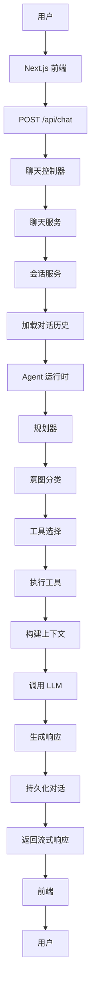

---

## 6.3 聊天请求工作流

标准对话遵循以下工作流：

```plaintext
用户输入
    ↓
验证请求
    ↓
加载会话
    ↓
恢复历史
    ↓
规划器
    ↓
选择工具
    ↓
执行工具
    ↓
构建提示上下文
    ↓
LLM 生成
    ↓
保存对话
    ↓
返回响应
```

> **注意**：无论具体用户意图如何，每个请求都遵循相同的生命周期。

---

## 6.4 意图分类

规划器的首要职责是确定用户意图。

当前支持的意图：

| 意图             | 描述                              |
|------------------|-----------------------------------|
| 一般对话         | 一般性一级方程式讨论              |
| 新闻查询         | 最新一级方程式新闻                |
| 赛事信息         | 日历、积分榜、日程                |
| 规则问答         | FIA 运动规则或技术规则            |
| 策略分析         | 比赛策略讨论                      |

### 示例 1
```plaintext
用户：
今天发生了什么？

↓

意图：
新闻查询
```

### 示例 2
```plaintext
用户：
解释封闭区。

↓

意图：
规则问答
```

---

## 6.5 工具选择

确定意图后，规划器选择一个或多个工具。

### 单一工具执行
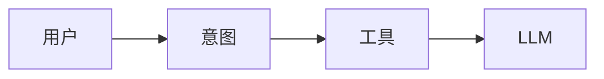

### 多工具执行
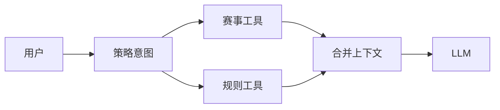

> 当需要跨领域知识时，可执行多个工具。

---

## 6.6 工具执行

每个工具独立执行。Agent 运行时**仅**与工具接口通信。

### 新闻工具执行
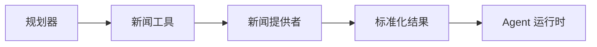

### 规则工具执行
```mermaid
flowchart LR
    Planner[规划器] --> Regulation_Tool[规则工具] --> Knowledge_Service[知识服务] --> PostgreSQL + pgvector --> Retrieved_Chunks[检索片段] --> Agent_Runtime[Agent 运行时]
```

> **关键原则**：Agent 运行时**不感知**每个工具内部的实现细节。

---

## 6.7 上下文构建

所有工具执行完成后，上下文构建器构建提示：

```plaintext
系统提示
+
对话历史
+
检索到的知识
+
工具输出
+
当前用户问题
↓
最终提示
```

### 上下文构建器职责
- 移除重复信息
- 保持时间顺序
- 执行令牌限制
- 格式化检索文档

---

## 6.8 语言模型调用

提示构建完成后，响应生成器调用配置的语言模型：

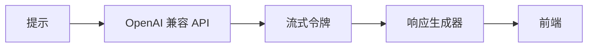

> 响应生成器支持**流式输出**以降低感知延迟。

---

## 6.9 对话持久化

响应生成后，对话被存储：

```plaintext
用户消息
+
助手响应
↓
聊天仓库
↓
PostgreSQL
```

> 对话历史在同一会话内的未来请求中可用。

---

## 6.10 错误工作流

错误在尽可能低的层级处理：

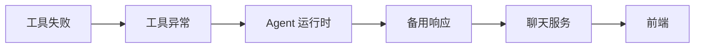

### 错误处理原则
1. 系统应尽可能继续运行
2. **绝不**向用户暴露内部实现细节
3. 返回用户友好的备用响应

---

## 6.11 重试策略

不同组件采用不同重试策略：

| 组件          | 重试策略                         |
|---------------|----------------------------------|
| 新闻 API      | 指数退避（3 次尝试）            |
| 赛事 API      | 指数退避（3 次尝试）            |
| LLM API       | 指数退避（2 次尝试）            |
| PostgreSQL    | 不重试                          |
| Redis         | 指数退避（5 次尝试）            |
| PostgreSQL + pgvector        | 指数退避（3 次尝试）            |

> 所有重试均采用**指数退避**，以避免压垮外部服务。

---

## 6.12 超时策略

每个外部依赖必须定义超时：

| 组件          | 超时    | 理由                              |
|---------------|---------|-----------------------------------|
| LLM           | 60s     | 允许足够生成时间                  |
| 新闻 API      | 10s     | 新闻服务应快速响应                |
| 赛事 API      | 10s     | 实时赛事数据需要速度              |
| PostgreSQL + pgvector        | 15s     | 向量搜索可能涉及复杂操作          |
| Redis         | 5s      | 缓存操作必须极快                  |
| PostgreSQL    | 10s     | 平衡查询复杂性和响应能力          |

> 超时防止请求阻塞整个工作流。

---

## 6.13 运行时状态

每个聊天请求创建一个隔离的运行时状态，包含：

- 请求 ID
- 会话 ID
- 用户查询
- 对话历史
- 检索到的上下文
- 工具结果
- 当前意图
- 最终提示
- 生成的响应

> 运行时状态**仅在请求期间存在**。持久对话历史由会话服务单独管理。

---

## 6.14 运行时特性

运行时工作流满足以下特性：

| 特性                          | 实现优势                              |
|-------------------------------|---------------------------------------|
| 确定性执行流程                | 可预测行为，便于调试/测试             |
| 无状态 HTTP 请求             | 支持水平扩展                          |
| 基于会话的记忆                | 无需服务器状态即可维护上下文          |
| 基于工具的推理                | 模块化架构，可扩展                    |
| 检索在先，生成在后            | 确保响应基于数据                      |
| 流式响应                      | 降低感知延迟                          |
| 优雅故障处理                  | 在部分故障时保持可用性                |

> 这些特性提供了可靠且可维护的执行模型，适合生产部署。

---

**第 6 章结束**

# 第 7 章 数据架构

## 7.1 概述

数据是 PitWall Agent 的核心资产之一。

与传统 Web 应用主要存储结构化业务数据不同，PitWall Agent 管理多类信息，包括：
- 关系型数据
- 向量嵌入
- 缓存对象
- 非结构化文档

为了满足这些多样化需求，系统采用**多语言持久化**架构。

> **关键原则**：每种存储技术根据其优势选择，而非将所有数据强制放入单一数据库。

---

## 7.2 数据存储架构

整体存储架构：

```mermaid
flowchart TB
    Application_Services[应用服务] --> PostgreSQL
    Application_Services --> Redis
    Application_Services --> Knowledge_Service[知识服务]
    Knowledge_Service --> PostgreSQL + pgvector
    PostgreSQL + pgvector --> Object_Storage["对象存储\n(规则 PDF)"]
```

每个存储组件具有**明确定义的职责边界**。

---

## 7.3 PostgreSQL

### 目的
用于需要**事务一致性**的结构化业务数据的主关系数据库。

### 存储数据
- 聊天会话
- 对话历史
- 用户偏好（未来）
- 应用元数据
- 定时任务元数据
- 系统配置
- 文档元数据

> **排除原则**：大型文档和向量嵌入**不存储**在 PostgreSQL 中。

### 设计原则
针对以下方面优化：
- ACID 事务
- 关系查询
- 数据完整性
- 历史记录

> **反模式**：绝不应用于缓存或向量数据库。

---

## 7.4 Redis

### 目的
用于受益于**低延迟访问**的临时数据的高速内存存储。

### 存储数据
- 会话缓存
- 工具执行缓存
- 速率限制计数器
- 临时运行时状态
- 频繁请求的赛事信息

### 缓存策略
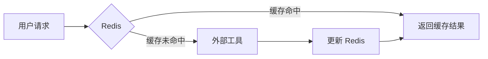

### 过期策略
| 数据类型         | TTL          |
|------------------|--------------|
| 新闻             | 10 分钟      |
| 赛事日程         | 1 小时       |
| 积分榜           | 30 分钟      |
| 工具结果         | 5 分钟       |

> 所有缓存数据**必须**定义明确的过期时间。

---

## 7.5 PostgreSQL + pgvector

### 目的
用于**语义检索**的向量数据库 —— RAG 管道的基础。

### 存储数据
- 规则嵌入
- 片段元数据
- 向量索引

> **排除原则**：原始 PDF 文件**不存储**在 PostgreSQL + pgvector 中。

### 检索工作流
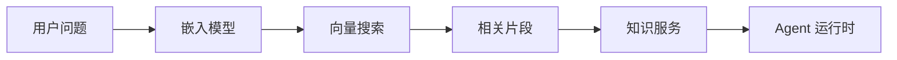

### 索引策略
每个规则文档被划分为语义片段，包含：
- 文本内容
- 向量嵌入
- 文档 ID
- 章节标题
- 条款编号
- 页码

> **关键优势**：此元数据支持在响应中生成**精确引用**。

---

## 7.6 对象存储

### 目的
管理大型二进制资产。

### 存储数据
- FIA 规则 PDF
- 未来上传的文档
- 生成的报告
- 导出的日志

> **反模式**：绝不应用于结构化应用数据。

---

## 7.7 仓库模式

应用服务**绝不**直接与存储系统通信。

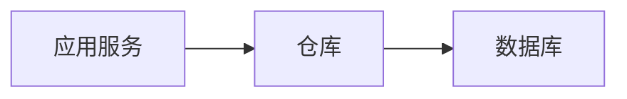

### 仓库职责
- CRUD 操作
- 查询执行
- 事务处理
- 数据映射

> **边界**：仓库**不负责**业务逻辑。

---

## 7.8 数据生命周期

规则文档生命周期：


> **关键说明**：此管道在**文档摄入期间**执行 —— **不在**用户交互期间。

---

## 7.9 对话数据流

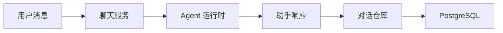

> **注意**：对话历史在后续请求**开始时**被检索。

---

## 7.10 新闻数据流

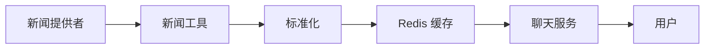

> **优化**：频繁请求的新闻条目尽可能**直接从缓存**提供。

---

## 7.11 赛事数据流

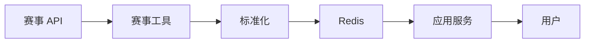

> **关键说明**：赛事信息**定期刷新**以确保数据新鲜度。

---

## 7.12 知识检索流

```mermaid
flowchart LR
    A[问题] --> B[嵌入生成]
    B --> C[PostgreSQL + pgvector 搜索]
    C --> D[Top-K 结果]
    D --> E[重排序\n(未来)]
    E --> F[相关上下文]
    F --> G[LLM]
```

> **核心原则**：此工作流确保响应**基于权威文档**。

---

## 7.13 数据所有权

| 组件          | 拥有的数据类别                |
|---------------|-------------------------------|
| PostgreSQL    | 结构化业务数据                |
| Redis         | 临时缓存数据                  |
| PostgreSQL + pgvector        | 向量嵌入                      |
| 对象存储      | 二进制文件                    |

> **关键规则**：所有权**绝不能**不必要地重叠。

---

## 7.14 数据一致性

| 数据类别               | 策略               |
|------------------------|--------------------|
| 对话历史               | 强一致性           |
| 会话元数据             | 强一致性           |
| 规则嵌入               | 最终一致性         |
| 缓存新闻               | 最终一致性         |
| 赛事信息缓存           | 最终一致性         |

> **设计理由**：选择适当的⼀致性模型可提高**性能**和**可靠性**。

---

## 7.15 设计原则

数据架构遵循以下核心原则：

1. **技术对齐**：为每种数据类型使用适当的存储技术

2. **关注点分离**：保持业务逻辑与存储实现独立

3. **数据最小化**：除非性能需要，避免存储重复信息

4. **缓存完整性**：仅缓存**可重现**的数据

5. **权威来源**：在持久存储中保留原始数据

6. **可解释性**：构建支持**可验证** AI 响应的检索管道

> 这些原则确保 PitWall Agent 拥有**可扩展**且**可维护**的数据基础。

---

**第 7 章结束**

# 第 8 章 部署架构

## 8.1 概述

PitWall Agent 设计支持：
- 本地开发环境
- 生产部署

为确保可移植性和可重现性：
- 所有核心组件作为**独立 Docker 服务**运行
- **应用服务**与**基础设施服务**明确分离
- 每个组件独立演进，同时保持接口契约

> **关键原则**：部署架构必须支持从开发到生产的无缝过渡，无需代码变更。

---

## 8.2 部署拓扑

```mermaid
flowchart TB
    User["用户\n(浏览器/移动端)"] -->|HTTPS/HTTP| Nginx["Nginx\n(反向代理)"]
    Nginx -->|静态文件| NextJS["Next.js UI"]
    Nginx -->|REST API| FastAPI["FastAPI\n(后端服务)"]
    
    FastAPI --> PostgreSQL["PostgreSQL\n(关系数据库)"]
    FastAPI --> Redis["Redis\n(缓存)"]
    FastAPI --> PostgreSQL + pgvector["PostgreSQL + pgvector\n(向量数据库)"]
    
    PostgreSQL + pgvector --> ObjectStorage["对象存储\n(规则 PDF)"]
    
    classDef service fill:#4e79a7,stroke:#333,stroke-width:1px;
    classDef infra fill:#59a14f,stroke:#333;
    
    class Nginx,NextJS,FastAPI service;
    class PostgreSQL,Redis,PostgreSQL + pgvector,ObjectStorage infra;
```

> **安全边界**：仅 Nginx 接受外部流量。所有基础设施服务**与公共访问隔离**。

---

## 8.3 部署组件

| 服务           | 职责                                          | 关键性   |
|----------------|-----------------------------------------------|----------|
| **Nginx**      | HTTPS 终止、反向代理、静态文件服务            | 高       |
| **Next.js**    | Web 前端、UI 渲染、响应流式传输               | 高       |
| **FastAPI**    | 后端 API、Agent 运行时、业务逻辑              | 关键     |
| **PostgreSQL** | 持久化关系存储                                | 关键     |
| **Redis**      | 缓存、临时状态、速率限制                      | 中       |
| **PostgreSQL + pgvector**     | 向量嵌入存储和搜索                            | 高       |
| **对象存储**   | 二进制文档存储（PDF、报告）                   | 中       |

> **通信**：所有服务仅通过内部 Docker 网络交互。

---

## 8.4 容器职责

### Nginx
- ✅ HTTPS 终止
- ✅ 反向代理路由
- ✅ 静态文件服务
- ✅ 请求压缩
- ❌ 不实现业务逻辑

### Next.js
- ✅ UI 渲染和客户端路由
- ✅ 流式聊天响应处理
- ✅ Markdown 和引用显示
- ✅ API 通信（仅与 FastAPI）
- ❌ 不直接访问数据库

### FastAPI
- ✅ REST API 实现
- ✅ Agent 运行时协调
- ✅ 工具执行管理
- ✅ 会话生命周期控制
- ✅ 业务服务编排

### 基础设施服务
| 服务        | 主要职责                              |
|-------------|---------------------------------------|
| PostgreSQL  | ACID 兼容的事务数据存储               |
| Redis       | 亚毫秒级缓存，用于频繁访问的数据      |
| PostgreSQL + pgvector      | 通过向量嵌入进行高性能语义搜索        |

---

## 8.5 网络架构

```mermaid
flowchart LR
    Internet[互联网] -->|外部流量| Nginx
    Nginx -->|内部网络| NextJS
    Nginx -->|内部网络| FastAPI
    
    subgraph Internal_Network["内部 Docker 网络"]
        FastAPI --> PostgreSQL
        FastAPI --> Redis
        FastAPI --> PostgreSQL + pgvector
        PostgreSQL + pgvector --> ObjectStorage
    end
    
    classDef internal fill:#f2f2f2,stroke-dasharray: 5 5;
    class Internal_Network internal;
```

> **关键安全实践**：基础设施服务（PostgreSQL、Redis、PostgreSQL + pgvector）**绝不暴露**到外部网络。

---

## 8.6 环境配置

配置通过环境变量严格管理：

### 核心应用
| 变量            | 目的               | 示例值              |
|-----------------|--------------------|---------------------|
| `APP_ENV`       | 环境模式           | `production`        |
| `APP_HOST`      | 绑定地址           | `0.0.0.0`           |
| `APP_PORT`      | 服务端口           | `8000`              |

### 数据服务
| 变量                | 目的                          |
|---------------------|-------------------------------|
| `DATABASE_URL`      | PostgreSQL 连接字符串         |
| `REDIS_URL`         | Redis 连接端点                |
| `PostgreSQL + pgvector_HOST`       | 向量数据库主机                |
| `PostgreSQL + pgvector_PORT`       | 向量数据库端口                |

### AI 组件
| 变量                    | 目的                          |
|-------------------------|-------------------------------|
| `OPENAI_API_KEY`        | LLM 提供者认证                |
| `OPENAI_BASE_URL`       | 自定义 LLM 端点（如使用）     |
| `MODEL_NAME`            | 目标语言模型标识符            |
| `EMBEDDING_MODEL`       | 嵌入模型规范                  |

> **安全要求**：密钥**绝不**硬编码在源代码中。

---

## 8.7 Docker Compose 架构

```mermaid
flowchart TB
    docker-compose["docker-compose.yml"] --> nginx
    docker-compose --> frontend["Next.js"]
    docker-compose --> backend["FastAPI"]
    docker-compose --> postgres
    docker-compose --> redis
    docker-compose --> PostgreSQL + pgvector
    
    classDef compose fill:#e15759,stroke:#333;
    class docker-compose compose;
```

> **生命周期管理**：每个服务维护独立的启动/关闭序列，并配有适当的健康检查。

---

## 8.8 持久卷

| 服务          | 持久数据                         | 卷类型      |
|---------------|----------------------------------|-------------|
| PostgreSQL    | 数据库文件                       | 命名卷      |
| PostgreSQL + pgvector        | 向量索引                         | 命名卷      |
| 对象存储      | 规则 PDF、用户上传               | 绑定挂载    |
| Nginx         | SSL 证书                         | 绑定挂载    |
| Redis         | 缓存（v1.0 中为临时）            | 无          |

> **数据完整性原则**：持久数据必须在容器重建后存活。

---

## 8.9 启动顺序

```mermaid
flowchart LR
    PostgreSQL --> Redis
    Redis --> PostgreSQL + pgvector
    PostgreSQL + pgvector --> FastAPI
    FastAPI --> NextJS
    NextJS --> Nginx
    
    classDef critical fill:#e15759,stroke:#333;
    class PostgreSQL,Redis,PostgreSQL + pgvector critical;
```

> **依赖规则**：在所有必需的基础设施服务报告健康状态之前，应用服务**不得初始化**。

---

## 8.10 健康检查

### 后端服务（`FastAPI`）
```http
GET /health
```
**验证包括**：
- PostgreSQL 连通性
- Redis 缓存可用性
- PostgreSQL + pgvector 向量数据库状态
- LLM API 连通性

**预期响应**：
```json
{
  "status": "healthy",
  "services": {
    "database": "connected",
    "cache": "available",
    "vector_db": "ready"
  }
}
```

### 前端服务（`Next.js`）
轻量级端点验证：
- API 连通性
- 静态资产可用性

> **生产要求**：所有服务必须实现标准化健康端点，供编排系统使用。

---

## 8.11 部署模式

### 开发模式
| 特性               | 实现                     |
|--------------------|--------------------------|
| 容器编排           | 本地 Docker Compose      |
| 日志               | 详细调试输出             |
| 代码重载           | 启用热重载               |
| API 密钥           | 开发/测试凭据            |
| 安全               | HTTP（无 HTTPS）         |

### 生产模式
| 特性               | 实现                     |
|--------------------|--------------------------|
| 容器编排           | 优化后的 Docker Compose  |
| 日志               | 结构化生产日志           |
| 安全               | HTTPS 及有效证书         |
| 密钥管理           | 安全外部保管库集成       |
| 资源限制           | 启用 CPU/内存限制        |
| 重启策略           | 自动故障恢复             |

---

## 8.12 未来部署演进

```mermaid
flowchart LR
    Current["Docker Compose\n(v1.0)"] -->|未来目标| Kubernetes
    Current -->|未来目标| DockerSwarm
    Current -->|未来目标| Nomad
    
    classDef future fill:#499894,stroke:#333;
    class Kubernetes,DockerSwarm,Nomad future;
```

> **关键设计原则**：应用代码包含**零编排特定逻辑**，以实现无缝迁移。

---

## 8.13 部署原则

1. **独立可部署性**  
   每个服务可独立更新/部署，不影响其他服务

2. **基础设施隔离**  
   数据库和缓存服务**完全隐藏**于公共网络

3. **无状态应用设计**  
   前端和后端服务不维护持久状态（支持水平扩展）

4. **外部化配置**  
   所有环境特定设置通过运行时变量管理

5. **持久数据分离**  
   卷与应用容器独立管理

6. **标准化接口**  
   服务通过定义良好的网络协议通信

> 这些原则确保 PitWall Agent 保持**生产就绪**，同时支持开发敏捷性。

---

**第 8 章结束**

# 第 9 章 安全架构

## 9.1 概述
> **安全性是 PitWall Agent 架构中的基本考虑因素。**

尽管 **版本 1.0** 主要作为作品集质量应用，但它采用**面向生产的安全实践**，确保系统可安全部署和扩展。

安全架构遵循**纵深防御**原则，在应用堆栈的多个层次应用保护措施。

---

## 9.2 安全目标
主要安全目标包括：

- **保护敏感配置：** 安全管理密钥和凭证。
- **验证所有外部输入：** 在入口点进行严格验证。
- **防止未授权访问：** 实施访问控制机制。
- **保护基础设施服务：** 隔离内部组件。
- **确保安全通信：** 加密数据传输。
- **最小化攻击面：** 减少暴露的端点。
- **保持应用可用性：** 防范 DoS/滥用。

---

## 9.3 信任边界
系统划分为多个信任区域，以隔离关键组件。

```text
                       互联网
                           │
                           ▼
             ┌─────────────────────────┐
             │   反向代理 (Nginx)       │  <-- 公共入口点
             └───────────┬─────────────┘
                         │
                         ▼
             ┌─────────────────────────┐
             │     前端应用             │
             └───────────┬─────────────┘
                         │
                         ▼
             ┌─────────────────────────┐
             │      FastAPI 后端       │  <-- 应用核心
             └───────────┬─────────────┘
                         │
       ┌─────────────────┼─────────────────┐
       │                 │                 │
       ▼                 ▼                 ▼
┌─────────────┐   ┌─────────────┐   ┌─────────────┐
│  PostgreSQL │   │    Redis    │   │    PostgreSQL + pgvector   │
└─────────────┘   └─────────────┘   └─────────────┘
      （仅限内部网络）
```

- **公共区域：** 仅 **Nginx** 接受公共流量。
- **内部区域：** 所有基础设施服务（数据库、缓存、向量存储）在隔离的内部网络中运行。

---

## 9.4 密钥管理
**敏感信息绝不能存储在源代码中。**

### 密钥范围
- OpenAI API 密钥
- 数据库凭证
- Redis 密码
- PostgreSQL + pgvector 凭证
- JWT 密钥（未来）
- 第三方 API 密钥

### 注入方式
密钥在部署期间通过**环境变量**注入。

---

## 9.5 输入验证
后端接收的每个请求都必须经过验证。**Pydantic 模型**用于在进入业务逻辑之前验证所有 API 负载。

**验证标准：**
- 必填字段
- 数据类型
- 最大长度
- 非法字符
- 空请求

---

## 9.6 提示注入防护
由于 PitWall Agent 与大型语言模型交互，提示注入被视为潜在威胁。

**缓解策略：**
1. **分离：** 将系统提示与用户输入分离。
2. **隐藏：** 绝不暴露内部提示。
3. **限制：** 将工具执行限制为经批准的接口。
4. **完整性：** 防止用户输入修改系统指令。
5. **验证：** 在执行前验证工具参数。

> **注意：** Agent 运行时对工具选择和执行保持完全控制。

---

## 9.7 工具执行安全
Agent 运行时**不执行任意代码**。每个工具都受到严格管理：

- **显式注册：** 仅已知工具存在于注册表中。
- **权限控制：** 按工具定义访问权限。
- **独立验证：** 使用前检查输入。

**约束：** 规划器只能调用已批准的工具。禁止动态执行未知工具。

---

## 9.8 外部 API 安全
与第三方服务的通信遵循以下原则：

- **仅 HTTPS：** 加密传输层。
- **弹性：** 请求超时和重试限制。
- **健壮性：** 全面错误处理。
- **认证：** API 密钥认证。
- **验证：** 外部响应在使用前进行验证。

---

## 9.9 数据库安全
数据库访问遵循**仓库模式**。应用组件绝不直接执行原始 SQL。

**安全措施：**
- 参数化查询（防止 SQL 注入）
- 最小权限原则
- 连接池
- 事务管理

> **警告：** 应用绝不应使用管理凭证。

---

## 9.10 网络安全
部署架构最小化暴露的服务。

| 可见性       | 服务                                      |
| :----------- | :---------------------------------------- |
| **公开可访问** | Nginx                                    |
| **仅限内部**   | FastAPI、PostgreSQL、Redis、PostgreSQL + pgvector       |

**规则：** 基础设施服务绝不应从公共互联网直接访问。

---

## 9.11 CORS 策略
后端明确定义允许的来源，以防止跨域资源共享攻击。

**推荐配置：**
- 仅允许受信任的前端域名。
- 适当限制 HTTP 方法（例如 `GET`、`POST`）。
- 限制自定义头部。
- **在生产中禁用通配符来源（`*`）。**

---

## 9.12 速率限制
为减少滥用，使用 **Redis** 实现请求速率限制，维护请求计数器。

| 端点            | 推荐限制              |
| :-------------- | :-------------------- |
| `/api/chat`     | 60 请求/分钟          |
| `/api/news`     | 30 请求/分钟          |
| `/api/race`     | 60 请求/分钟          |
| `/health`       | 较高限制              |

---

## 9.13 认证路线图
**版本 1.0** 不需要用户认证。但架构为未来身份管理预留了扩展点。

**未来机制：**
- JWT（JSON Web 令牌）
- OAuth2
- OpenID Connect
- 企业 SSO

应用层设计可容纳这些增强，无需重大重构。

---

## 9.14 日志安全
应用日志必须经过净化。

**日志中禁止包含：**
- API 密钥
- 密码
- 认证令牌
- 敏感环境变量

*用户消息可出于调试目的记录，但需遵守隐私要求。*

---

## 9.15 安全原则
PitWall Agent 遵循以下核心原则，确保安全基础：

1. **绝不信任外部输入。**
2. **在处理前验证。**
3. **在源代码外保护密钥。**
4. **限制对基础设施服务的访问。**
5. **仅执行已批准的工具。**
6. **最小化暴露的攻击面。**
7. **尽可能应用最小权限访问。**

---
**第 9 章结束**

# 第 10 章 日志与可观测性

## 10.1 概述

可观测性是 **PitWall Agent** 的一流架构关注点。

与传统 Web 应用不同，AI 原生系统涉及推理、工具执行、检索和语言模型推理等多个阶段。  
单个用户请求在生成响应之前可能遍历数十个组件。

因此，**全面的日志记录、追踪和运行时监控**对于调试、性能分析和生产运维至关重要。

---

## 10.2 可观测性架构

可观测性管道遵循端到端执行流程：

```
用户请求
     │
     ▼
  FastAPI
     │
     ▼
应用服务
     │
     ▼
 Agent 运行时
     │
     ▼
 工具执行
     │
     ▼
知识检索
     │
     ▼
 LLM 调用
     │
     ├──► 结构化日志
     ├──► 执行追踪
     └──► 指标
     │
     ▼
监控平台
```

完整执行链**必须可从始至终追溯**。

---

## 10.3 日志级别

应用遵循标准日志级别：

| 级别       | 描述                         |
|------------|------------------------------|
| `DEBUG`    | 开发诊断                     |
| `INFO`     | 正常业务事件                 |
| `WARNING`  | 可恢复的异常情况             |
| `ERROR`    | 失败操作                     |
| `CRITICAL` | 系统级故障                   |

> **生产部署**应默认使用 `INFO` 级别。

---

## 10.4 结构化日志

所有日志**必须**使用结构化格式，而非纯文本。

**示例（JSON）：**
```json
{
  "request_id":   "...",
  "session_id":   "...",
  "component":    "ChatService",
  "operation":    "invoke_agent",
  "duration_ms":  318,
  "status":       "success"
}
```

结构化日志支持高效的搜索、聚合和监控。

---

## 10.5 请求标识

每个传入请求接收一个**唯一请求 ID**，并在整个系统中传播。

**工作流：**
```
HTTP 请求
     │
     ▼
生成请求 ID
     │
     ▼
附加到运行时状态
     │
     ▼
在组件间传播
     │
     ▼
写入日志
     │
     ▼
返回响应
```

使用请求 ID 允许开发人员**重建任何请求的完整执行路径**。

---

## 10.6 Agent 执行日志

Agent 运行时记录每个主要执行步骤。

**记录典型事件：**
- 意图分类
- 规划器执行
- 工具选择
- 工具执行
- 上下文构建
- 提示生成
- LLM 调用
- 响应生成

这些日志提供推理工作流的可见性，**而不暴露内部提示**。

---

## 10.7 工具执行日志

每个工具调用应记录：

| 字段            | 描述                         |
|-----------------|------------------------------|
| 工具名称        | 工具标识符                   |
| 调用时间        | 开始时间戳                   |
| 完成时间        | 结束时间戳                   |
| 执行持续时间    | 总耗时                       |
| 成功/失败       | 结果状态                     |
| 错误详情        | （如适用）                   |

**示例：**
```text
工具: 新闻工具
状态: 成功
持续时间: 412 ms
```

---

## 10.8 检索日志

RAG 管道记录检索特定信息：

| 字段               | 描述                         |
|--------------------|------------------------------|
| 检索到的文档 ID    | 获取的文档标识符             |
| 片段数量           | 检索到的片段数               |
| 相似度分数         | 每个片段的相关性分数         |
| 检索延迟           | 向量搜索持续时间             |

这些日志帮助开发人员**评估检索质量**并诊断故障。

---

## 10.9 语言模型日志

响应生成器记录每次模型调用的元数据：

| 字段             | 描述                         |
|------------------|------------------------------|
| 模型名称         | 例如 `gpt-4`、`claude-3`    |
| 请求时间戳       | 调用时间                     |
| 响应延迟         | 端到端推理时间               |
| 令牌使用量       | 输入/输出令牌数              |
| 完成状态         | 成功/失败/超时               |

> **重要：** 敏感提示内容**绝不能**写入生产日志。

---

## 10.10 性能指标

系统收集主要组件的运行时指标。

**推荐指标：**

| 指标              | 描述                                 |
|-------------------|--------------------------------------|
| 请求持续时间      | 总请求处理时间                       |
| 工具延迟          | 单个工具执行时间                     |
| 检索延迟          | 向量搜索持续时间                     |
| LLM 延迟          | 模型推理持续时间                     |
| 缓存命中率        | Redis 有效性                         |
| 错误率            | 失败请求百分比                       |

这些指标支持**性能优化**和**容量规划**。

---

## 10.11 分布式追踪

尽管版本 1.0 作为单一后端服务部署，但架构设计支持分布式追踪。

每个主要操作贡献于**统一执行追踪**。

**示例追踪：**
```
请求
   │
   ▼
聊天服务
   │
   ▼
规划器
   │
   ▼
规则工具
   │
   ▼
知识服务
   │
   ▼
PostgreSQL + pgvector
   │
   ▼
LLM
   │
   ▼
响应
```

此执行链允许开发人员精确定位**性能瓶颈**和**故障点**。

---

## 10.12 LangSmith 集成

**LangSmith** 用于观察 Agent 运行时行为。

**典型能力：**
- 工作流可视化
- 工具执行追踪
- 提示检查
- 模型性能分析
- 故障诊断

LangSmith 主要用于**开发和测试**。  
对于生产部署，确保敏感数据得到妥善处理。

---

## 10.13 错误监控

错误应记录足够的诊断信息。

**每个错误日志应包括：**
- 请求 ID
- 组件名称
- 操作名称
- 错误类型
- 时间戳
- 堆栈跟踪（*仅开发环境*）

> 可恢复错误**不应**终止整个请求生命周期。

---

## 10.14 健康监控

应用定期检查关键依赖的健康状态。

**监控的服务：**
- PostgreSQL
- Redis
- PostgreSQL + pgvector
- 外部 API
- LLM 提供者

健康状态可通过专用监控端点（例如 `/health`）暴露。

---

## 10.15 可观测性原则

PitWall Agent 遵循以下基础可观测性原则：

1. **每个请求都应可追踪。**
2. **每个工具调用都应可度量。**
3. **每个外部依赖都应暴露健康信息。**
4. **日志应为结构化且机器可读。**
5. **监控数据应同时支持调试和性能分析。**
6. **敏感信息绝不能出现在生产日志中。**

这些原则确保系统在整个生命周期中保持**透明、可诊断和可维护**。

---

**第 10 章结束**

# 第 11 章 可扩展性与扩展

## 11.1 概述

**PitWall Agent** 版本 1.0 有意采用简单且可维护的架构，以单个智能 Agent 运行时为中心。

然而，系统设计时考虑了**长期演进**。  
每个主要组件都暴露清晰的扩展点，允许在不进行根本性架构变更的情况下引入未来能力。

指导原则是：

> **开放扩展，封闭修改。**

---

## 11.2 工具可扩展性

**工具层**是系统的主要扩展机制。  
添加新能力通常应通过实现新工具，而非修改现有业务逻辑。

**当前工具包括：**

- 新闻工具
- 赛事工具
- 规则工具
- 策略工具

**潜在未来工具包括：**

- 天气工具
- 车手统计工具
- 赛道信息工具
- FIA 文档工具
- 图像分析工具
- 翻译工具
- 语音工具

每个工具必须实现**通用接口**，以便 Agent 运行时统一调用。

---

## 11.3 知识库扩展

版本 1.0 聚焦于 FIA 运动规则和技术规则。  
知识层设计支持多个独立知识集合。

**可能的未来集合包括：**

- FIA 运动规则
- FIA 技术规则
- FIA 财务规则
- 一级方程式官方文件
- 车队技术指令
- FIA 仲裁决定
- 历史规则

检索管道应支持根据用户意图查询**一个或多个集合**。

---

## 11.4 模型提供者抽象

架构将应用与特定 LLM 提供者分离。

**支持的提供者可能包括：**

- OpenAI
- Azure OpenAI
- Anthropic
- Google Gemini
- DeepSeek
- Qwen
- 通过 Ollama 或 vLLM 的本地模型

更换提供者应只需**配置更新**，而非应用代码变更。

---

## 11.5 嵌入模型演进

嵌入管道同样被抽象化。

**可能的未来嵌入模型包括：**

- BGE‑M3
- bge‑large‑en
- E5
- Jina Embeddings
- OpenAI Embeddings

知识服务应仅依赖于**通用嵌入接口**。

---

## 11.6 多 Agent 演进

版本 1.0 有意避免多 Agent 架构。  
单个 Agent 运行时对当前项目范围已足够，且复杂度更低。

如果未来需求需要更多专业化，架构可向多个协调 Agent 演进。

**示例演进路径：**

```
                     监督 Agent
                            │
            ┌───────────────┼───────────────┐
            │               │               │
            ▼               ▼               ▼
      新闻 Agent       规则 Agent       策略 Agent
```

现有工具层可被这些专业化 Agent 复用。

---

## 11.7 MCP 兼容性

架构与**模型上下文协议（MCP）**兼容。

未来能力可通过 MCP 服务器暴露工具，实现与外部 AI 客户端的互操作性。

**潜在 MCP 服务包括：**

- 规则搜索服务器
- 赛事信息服务器
- 新闻检索服务器

当前工具抽象最小化了未来 MCP 集成所需的工作量。

---

## 11.8 多模态支持

未来版本可能引入多模态能力。

**潜在用例包括：**

- 基于图像的规则图示
- 赛道布局分析
- 比赛遥测可视化
- 截图解释
- PDF 注释
- 语音交互

这些能力可通过扩展工具层和前端来集成，**无需重新设计核心架构**。

---

## 11.9 前端演进

前端架构支持未来增强，例如：

- 用户认证
- 个人设置
- 保存对话
- 引用导航
- 丰富文档查看器
- 移动端响应式优化
- 渐进式 Web 应用（PWA）支持

后端 API 设计为在前端演进时保持**稳定**。

---

## 11.10 基础设施扩展

部署架构支持逐步扩展。

**示例包括：**

- 负载均衡器后的多个 FastAPI 实例
- 专用 Redis 集群
- 高可用 PostgreSQL
- 分布式 PostgreSQL + pgvector 部署
- CDN 用于静态资源

由于应用服务是**无状态**的，水平扩展只需最小改动。

---

## 11.11 后台处理

某些未来工作负载更适合异步执行。

**示例包括：**

- 规则摄入
- 嵌入生成
- 新闻同步
- 定时数据刷新
- 报告生成

这些任务可委托给后台工作器或任务队列，同时保留现有应用架构。

---

## 11.12 扩展原则

所有未来扩展应遵循以下原则：

1. **尽可能保留**现有公共接口。
2. **通过独立模块引入**新功能。
3. **避免**组件间不必要的耦合。
4. **保持**基础设施关注点与业务逻辑分离。
5. **优先**组合而非继承。
6. **维护**稳定 API 的向后兼容性。
7. **确保**新能力保持可观测、可测试和可部署。

这些原则使 PitWall Agent 能够从作品集项目演进为**生产就绪的 AI 平台**，同时不牺牲可维护性。

---

**第 11 章结束**

# 第 12 章 架构总结

## 12.1 概述

本文档展示了 **PitWall Agent** 的完整软件架构。

该架构旨在平衡**工程简洁性**、**生产就绪性**和**长期可扩展性**。

版本 1.0 不追求最大架构复杂度，而是强调清晰的职责、模块化组件和可维护的实现。

每个架构决策都根据以下标准进行评估：

- **简洁性**
- **可维护性**
- **可扩展性**
- **可靠性**
- **生产就绪性**

---

## 12.2 架构决策

若干关键架构决策奠定了 PitWall Agent 的基础。

### 分层架构

系统采用分层架构以分离关注点并最小化耦合。  
每一层具有明确定义的职责。

**优势包括：**

- 更易维护
- 更好的可测试性
- 清晰的模块所有权
- 减少依赖复杂度

---

### 单一 Agent 运行时

版本 1.0 采用**单一 Agent 运行时**，而非多个自治 Agent。

**原因包括：**

- 更简单的执行流程
- 更易调试
- 更低的运维复杂度
- 减少上下文同步
- 更快的开发速度

当新需求证明有必要时，架构对未来多 Agent 演进保持开放。

---

### 面向工具的设计

每个外部能力都实现为一个**工具**。

**这提供了：**

- 统一接口
- 独立开发
- 更易测试
- 提供者独立性
- 未来 MCP 兼容性

Agent 运行时专注于**推理和编排**，而非基础设施访问。

---

### 检索增强生成

PitWall Agent 依赖**检索增强生成**来回答规则相关问题。  
系统不单依赖模型知识，而是在生成响应前检索权威文档。

**优势包括：**

- 更高的事实准确性
- 可解释的答案
- 引用支持
- 减少幻觉
- 更易更新规则

---

### 多语言持久化

根据工作负载特征选择不同的存储技术。

| 技术        | 职责                       |
|-------------|----------------------------|
| PostgreSQL  | 结构化业务数据              |
| Redis       | 高速缓存                   |
| PostgreSQL + pgvector      | 向量搜索                   |
| 对象存储    | 二进制文档                 |

这种方法确保每种数据类型由最合适的存储系统管理。

---

### 容器化部署

每个主要组件作为独立容器部署。

**优势包括：**

- 可重现环境
- 简化部署
- 基础设施可移植性
- 水平可扩展性
- 运维隔离

---

## 12.3 架构优势

所提架构提供多项优势。

### 可维护性

组件具有明确定义的职责，并通过稳定接口通信。  
一个模块的变更对其他模块影响最小。

---

### 可扩展性

新能力通常通过添加工具、服务或知识集合引入。  
现有模块很少需要修改。

---

### 可靠性

故障尽可能隔离。  
外部依赖故障不应危及整个应用。  
优雅降级优于完全请求失败。

---

### 可测试性

每一层都可独立测试。

**推荐测试策略包括：**

- 单元测试
- 集成测试
- API 测试
- 端到端测试
- RAG 评估
- Agent 工作流测试

---

### 生产就绪性

架构包含必要的运维考虑，例如：

- 配置管理
- 结构化日志
- 健康检查
- 监控
- 容器化
- 部署自动化

这些特性支持在本地开发环境之外部署。

---

## 12.4 架构约束

版本 1.0 有意限制范围以保持实现质量。

**当前限制包括：**

- 单一 Agent 运行时
- 仅文本交互
- 会话级记忆
- Docker Compose 部署
- 无用户认证
- 英语优先规则语料

这些约束降低了复杂度，同时建立了坚实的工程基础。

---

## 12.5 未来路线图

架构支持未来演进，无需根本性重新设计。

**潜在增强包括：**

- 多 Agent 编排
- 模型上下文协议（MCP）
- 语音交互
- 多模态推理
- 额外规则集合
- 用户认证
- 个性化记忆
- Kubernetes 部署
- 企业管理
- 高级分析

这些能力可通过现有扩展点增量集成。

---

## 12.6 工程原则

在整个开发过程中，以下工程原则应指导实现。

1. 优先组合而非继承。
2. 保持模块松耦合。
3. 设计稳定的公共接口。
4. 将业务逻辑与基础设施分离。
5. 避免过早优化。
6. 优先考虑可读性和可维护性。
7. 从一开始就构建可观测性。
8. 编写全面的自动化测试。
9. 记录架构决策。
10. 将 AI 组件视为工程系统，而非孤立模型。

---

## 12.7 结论

PitWall Agent 展示了现代 AI 应用开发如何将传统软件工程与智能 Agent 能力相结合。

**该架构整合了：**

- **FastAPI** 用于后端服务
- **Next.js** 用于前端交互
- **LangGraph** 用于 Agent 编排
- **LangChain** 用于工具抽象
- **检索增强生成** 用于基于事实的响应
- **PostgreSQL + pgvector** 用于语义检索
- **PostgreSQL** 和 **Redis** 用于应用数据管理
- **Docker** 用于可重现部署

这些组件共同构成一个 cohesive 的、面向生产的 AI 应用架构。

最终系统不仅旨在作为功能完善的一级方程式助手，还可作为现代 AI 工程实践的全面展示，适用于技术面试、作品集展示以及未来真实世界的扩展。

---

## 附录 A. 架构原则检查清单

以下清单总结了项目采用的所有架构原则。

| 原则                         | 状态 |
|------------------------------|------|
| 分层架构                     | ✓    |
| 单一职责                     | ✓    |
| 关注点分离                   | ✓    |
| 面向工具设计                 | ✓    |
| 检索在先，生成在后           | ✓    |
| 无状态应用层                 | ✓    |
| 仓库模式                     | ✓    |
| 配置优先                     | ✓    |
| 结构化日志                   | ✓    |
| 容器化部署                   | ✓    |
| 可扩展工具框架               | ✓    |
| 面向生产的设计               | ✓    |

---

## 附录 B. 参考文档

本文档应与以下项目文档一起阅读：

- `00_Project_Overview.md`
- `01_Product_Requirement.md`
- `RFC-001_Tech_Stack.md`
- `RFC-002_Agent_Architecture.md`
- `RFC-003_Backend_Architecture.md`
- `RFC-004_RAG_Architecture.md`
- `RFC-005_Database_Design.md`
- `RFC-006_API_Design.md`
- `RFC-007_Deployment.md`
- `RFC-008_Testing_Strategy.md`

---

**文档结束**
