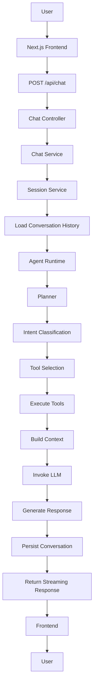
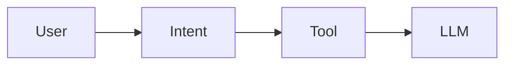
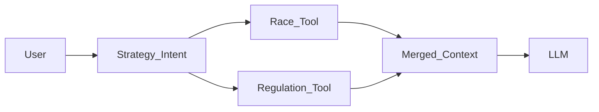
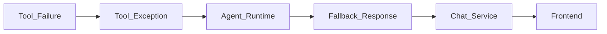
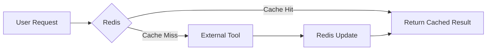
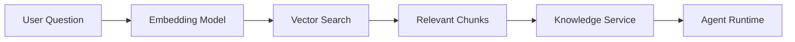
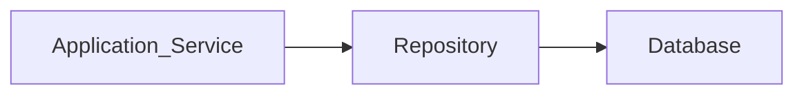
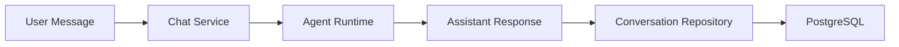
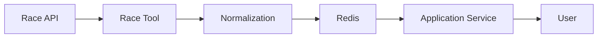

# System Architecture

# PitWall Agent

---

# Document Information

| Item | Value |
|------|-------|
| Document | System Architecture |
| Version | 1.0 |
| Status | Architecture Freeze V1 |
| Project | PitWall Agent |
| Audience | Software Engineers, AI Engineers, Architects |
| Related Documents | Project Overview, Product Requirement Document, RFC Series |

---

# Chapter 1. Introduction

## 1.1 Purpose

This document describes the overall software architecture of PitWall Agent.

It defines the structural organization of the system, the responsibilities of each module, the interactions between components, and the architectural principles that guide implementation.

Unlike the Product Requirement Document, which describes **what** the system should do, this document explains **how** the system is organized to achieve those requirements.

The architecture described here serves as the foundation for all subsequent implementation work and architectural RFCs.

---

## 1.2 Scope

This document covers the architecture of the complete PitWall Agent platform, including:

- Frontend architecture
- Backend architecture
- Agent Runtime
- Tool framework
- Knowledge retrieval
- Data persistence
- Background services
- Deployment architecture
- External integrations

Detailed implementation decisions are documented separately in the RFC documents.

---

## 1.3 Design Goals

The architecture is designed around the following goals.

### Scalability

The system should support future functional expansion without major architectural changes.

New capabilities should be introduced through modular extensions rather than modifications to existing components.

---

### Maintainability

Each module should have a clearly defined responsibility.

Business logic should remain independent of infrastructure details.

The codebase should be understandable by developers unfamiliar with the project.

---

### Reliability

External service failures should not cause the entire application to fail.

The system should degrade gracefully whenever possible.

---

### Extensibility

New tools, retrieval methods, data sources, and language models should be integrated with minimal changes to the existing architecture.

---

### Testability

Every major component should be independently testable.

Unit tests, integration tests, and end-to-end tests should all be supported.

---

### Production Readiness

The architecture should support deployment in a real production environment.

This includes:

- Configuration management
- Logging
- Monitoring
- Containerization
- Continuous Integration
- Continuous Deployment

---

# Chapter 2. Architectural Principles

The architecture of PitWall Agent follows several core principles.

These principles guide every implementation decision throughout the project.

---

## 2.1 Layered Architecture

PitWall Agent adopts a layered architecture.

Each layer communicates only with adjacent layers and exposes clearly defined interfaces.

This separation minimizes coupling and improves maintainability.

The primary layers are:

- Presentation Layer
- Application Layer
- Agent Runtime
- Tool Layer
- Knowledge Layer
- Infrastructure Layer

Each layer has a single responsibility and should not directly access components outside its intended scope.

---

## 2.2 Separation of Concerns

Responsibilities are separated according to business function.

Examples include:

Frontend

- User interaction
- Rendering
- Streaming output

Backend

- Request processing
- Session management
- Service orchestration

Agent Runtime

- Reasoning
- Planning
- Tool selection

Knowledge Layer

- Document retrieval
- Embedding
- Vector search

Infrastructure

- Databases
- Cache
- Object storage
- External services

No layer should assume responsibilities belonging to another layer.

---

## 2.3 Single Agent Architecture

PitWall Agent uses a single intelligent Agent Runtime.

Rather than creating multiple autonomous agents, the system delegates domain-specific tasks to specialized tools.

This approach provides several advantages:

- Lower complexity
- Easier debugging
- Predictable execution flow
- Simpler state management
- Better maintainability

The Agent Runtime is responsible for planning and orchestration rather than domain-specific implementation.

---

## 2.4 Tool-Oriented Design

Every external capability is encapsulated as a Tool.

Examples include:

- News Tool
- Race Tool
- Regulation Tool
- Strategy Tool

Each Tool exposes a stable interface to the Agent Runtime.

Internal implementation details remain hidden behind the tool abstraction.

This allows APIs or providers to change without affecting Agent logic.

---

## 2.5 Retrieval Before Generation

Whenever factual knowledge is required, external information should be retrieved before invoking the language model.

The language model should reason over retrieved evidence rather than relying solely on pre-trained knowledge.

This principle significantly improves factual accuracy and reduces hallucinations.

---

## 2.6 Service-Oriented Backend

Business logic is implemented inside application services.

The Agent Runtime is treated as one service within the backend rather than the backend itself.

Typical services include:

- Chat Service
- News Service
- Race Service
- Knowledge Service
- Session Service
- Scheduler Service

This separation enables easier testing and future migration to distributed architectures.

---

## 2.7 Configuration First

Environment-specific values must never be hard-coded.

Configuration should be provided through:

- Environment variables
- Configuration files
- Secret management systems

Examples include:

- Database URLs
- API Keys
- Model names
- Vector database endpoints

---

## 2.8 Observability

The system should expose sufficient runtime information for debugging and monitoring.

Observability includes:

- Structured logging
- Request tracing
- Agent execution records
- Tool execution logs
- Performance metrics

Operational visibility is considered a core architectural requirement rather than an optional feature.

---

## 2.9 Loose Coupling

Modules communicate through well-defined interfaces.

Replacing one implementation should not require changes to unrelated modules.

Examples include:

- Replacing the LLM provider
- Switching vector databases
- Changing embedding models
- Introducing new retrieval strategies

The architecture should minimize direct dependencies between business modules.

---

## 2.10 Future Evolution

Although Version 1.0 focuses on a single Agent Runtime, the architecture should allow future expansion.

Potential future directions include:

- Additional tools
- Multi-modal capabilities
- Distributed deployment
- Multiple knowledge bases
- Additional AI models
- Enterprise authentication

The current architecture intentionally leaves room for these future enhancements without requiring fundamental redesign.

---

**End of Chapter 1–2**

# Chapter 3. Overall Architecture

## 3.1 Architectural Overview

PitWall Agent adopts a layered architecture designed around a single intelligent Agent Runtime.

Instead of allowing the language model to directly access external resources, every external capability is encapsulated as a Tool. Business logic is implemented through application services, while infrastructure concerns remain isolated from the reasoning workflow.

The architecture emphasizes:

- High cohesion
- Low coupling
- Modular components
- Production readiness
- Extensibility

The Agent Runtime acts as the reasoning engine of the system but does not own business logic or infrastructure access.

---

## 3.2 High-Level Architecture

```

                                    User

                                      │

                                      ▼

                           Next.js Web Application

                                      │

                              HTTP / WebSocket

                                      │

                                      ▼

                                 FastAPI API

                                      │

                                      ▼

                          Application Service Layer

        ┌────────────────────────────────────────────────────┐

        │                                                    │

        │  Chat Service                                      │

        │  News Service                                      │

        │  Race Service                                      │

        │  Knowledge Service                                 │

        │  Session Service                                   │

        │  Scheduler Service                                 │

        │                                                    │

        └────────────────────────────────────────────────────┘

                                      │

                                      ▼

                            Agent Runtime (LangGraph)

                                      │

        ┌─────────────────────────────┼─────────────────────────────┐

        │                             │                             │

        ▼                             ▼                             ▼

    Planner                    Context Builder                Memory Manager

        │                             │                             │

        └─────────────────────────────┼─────────────────────────────┘

                                      │

                                      ▼

                                Tool Dispatcher

        ┌───────────────┬───────────────┬───────────────┬───────────────┐

        ▼               ▼               ▼               ▼

    News Tool      Race Tool      Regulation Tool   Strategy Tool

        │               │               │               │

        ▼               ▼               ▼               ▼

 External APIs    Race APIs      RAG Engine      Analysis Logic

                                      │

                                      ▼

                          Hybrid Retrieval Pipeline

                                      │

                    ┌─────────────────┴─────────────────┐

                    ▼                                   ▼

              PostgreSQL                          PostgreSQL + pgvector Vector DB

                    │

                    ▼

                 Redis Cache

```

---

## 3.3 Architectural Layers

The system consists of six logical layers.

Each layer has clearly defined responsibilities.

---

### Layer 1 — Presentation Layer

Responsible for all user interaction.

Components

- Next.js
- Chat interface
- Markdown rendering
- Streaming responses

Responsibilities

- Render user interface
- Collect user input
- Display generated responses
- Display citations
- Maintain client session

This layer contains no business logic.

---

### Layer 2 — Application Layer

Responsible for coordinating application workflows.

Components

- FastAPI
- REST API
- Authentication (future)
- Request validation

Responsibilities

- Receive requests
- Validate input
- Route requests
- Manage sessions
- Call application services
- Return HTTP responses

The Application Layer never performs reasoning.

---

### Layer 3 — Application Services

Application Services implement business workflows.

Each service focuses on one business capability.

Examples include:

- Chat Service
- News Service
- Race Service
- Knowledge Service
- Session Service
- Scheduler Service

Responsibilities include:

- Business orchestration
- Service coordination
- Data aggregation
- Error handling
- Cache utilization

Application Services invoke the Agent Runtime whenever reasoning is required.

---

### Layer 4 — Agent Runtime

The Agent Runtime is the intelligence center of the system.

Implemented using LangGraph, it is responsible for reasoning rather than business logic.

Responsibilities include:

- Intent analysis
- Planning
- Tool selection
- Tool orchestration
- Context construction
- Response generation

The Agent Runtime never:

- accesses databases directly
- performs SQL queries
- calls HTTP APIs directly
- manages infrastructure

Its only responsibility is intelligent orchestration.

---

### Layer 5 — Tool Layer

Every external capability is implemented as a Tool.

Each Tool exposes a unified interface regardless of its internal implementation.

Current tools include:

- News Tool
- Race Tool
- Regulation Tool
- Strategy Tool

Future tools may include:

- Weather Tool
- Telemetry Tool
- Statistics Tool
- Translation Tool

The Agent Runtime communicates only with Tools.

It never communicates directly with external systems.

---

### Layer 6 — Infrastructure Layer

Responsible for persistent storage and external dependencies.

Components include:

- PostgreSQL
- Redis
- PostgreSQL + pgvector
- Object Storage
- External APIs
- Embedding Models

Infrastructure components are hidden behind repositories and services.

Business logic must remain infrastructure-independent.

---

## 3.4 Request Lifecycle

A typical user request follows the workflow below.

### Step 1

The user submits a question through the web interface.

Example

> Why was Verstappen penalized?

---

### Step 2

The frontend sends the request to the FastAPI backend.

---

### Step 3

The Chat Service creates or restores the conversation session.

---

### Step 4

The Agent Runtime analyzes user intent.

Possible intents include:

- News
- Race
- Regulation
- Strategy
- General Conversation

---

### Step 5

The Planner determines which Tools should be executed.

Examples:

Question

"What happened today?"

↓

News Tool

Question

"What is Parc Fermé?"

↓

Regulation Tool

Question

"Who leads the championship?"

↓

Race Tool

---

### Step 6

The selected Tools retrieve external information.

Examples:

- News APIs
- FIA Regulations
- Race Database

---

### Step 7

The retrieved information is merged into a unified context.

---

### Step 8

The language model generates the final response using the retrieved context.

---

### Step 9

The response is streamed back to the frontend.

---

### Step 10

Conversation state is updated.

The session remains available for future follow-up questions.

---

## 3.5 Architectural Benefits

The selected architecture provides several advantages.

### Maintainability

Responsibilities are clearly separated.

Each module can evolve independently.

---

### Testability

Every layer can be tested independently.

Examples:

- API Tests
- Service Tests
- Agent Tests
- Tool Tests
- Repository Tests

---

### Extensibility

Adding new functionality typically requires implementing a new Tool rather than modifying existing logic.

---

### Reliability

Failures remain isolated.

For example:

If the News Tool becomes unavailable, regulation retrieval continues to function normally.

---

### Portability

Infrastructure components can be replaced with minimal impact.

Examples include:

- PostgreSQL → MySQL
- PostgreSQL + pgvector → Qdrant
- OpenAI → Azure OpenAI
- Redis → Valkey

The application architecture remains unchanged.

---

**End of Chapter 3**

# Chapter 4. Layer Design

## 4.1 Overview

The PitWall Agent backend follows a layered architecture.

Each layer has a single responsibility and communicates only with adjacent layers.

The implementation hierarchy is shown below.

```

```
Presentation Layer
        │
        ▼
Application Layer
        │
        ▼
Application Service Layer
        │
        ▼
Agent Runtime
        │
        ▼
Tool Layer
        │
        ▼
Knowledge Layer
        │
        ▼
Infrastructure Layer
```

```

Each layer is described in the following sections.

---

## 4.2 Presentation Layer

### Purpose

The Presentation Layer provides the user interface.

It is responsible only for presenting information and collecting user input.

No business logic should exist inside this layer.

---

### Responsibilities

- Chat interface
- Markdown rendering
- Streaming response display
- Conversation history
- Theme management
- User interaction

---

### Technologies

- Next.js
- React
- TypeScript
- TailwindCSS
- shadcn/ui

---

### Directory

```

frontend/

    app/

    components/

    hooks/

    services/

    types/

```

---

### Responsibilities Excluded

The Presentation Layer must never:

- call databases
- call PostgreSQL + pgvector
- execute tools
- perform retrieval
- invoke LangGraph directly

All requests must pass through the backend API.

---

## 4.3 Application Layer

### Purpose

The Application Layer exposes backend capabilities through HTTP APIs.

It is the entry point of the backend.

---

### Responsibilities

- HTTP Routing
- Request Validation
- Authentication (future)
- Session Management
- Response Formatting

---

### Technologies

- FastAPI
- Pydantic
- Uvicorn

---

### Directory

```

backend/

    api/

        routes/

        schemas/

        dependencies/

```

---

### Example

```
POST /api/chat

↓

Chat Router

↓

Chat Service

↓

Agent Runtime
```

The router never performs business logic.

---

## 4.4 Application Service Layer

### Purpose

Application Services coordinate business workflows.

They act as the bridge between APIs and the Agent Runtime.

---

### Responsibilities

- Business orchestration
- Session handling
- Cache coordination
- Repository coordination
- Agent invocation

---

### Current Services

Chat Service

Responsible for:

- conversation lifecycle
- invoking Agent Runtime
- streaming output

---

News Service

Responsible for:

- news retrieval
- cache management
- news normalization

---

Race Service

Responsible for:

- race schedules
- standings
- classifications

---

Knowledge Service

Responsible for:

- regulation retrieval
- vector search
- embedding management

---

Session Service

Responsible for:

- session creation
- history persistence
- memory retrieval

---

Scheduler Service

Responsible for:

- scheduled jobs
- document updates
- news synchronization

---

### Directory

```

backend/

    services/

        chat_service.py

        news_service.py

        race_service.py

        knowledge_service.py

        session_service.py

        scheduler_service.py

```

---

### Design Principles

Each Service should:

- expose a clean interface
- avoid infrastructure details
- avoid HTTP concerns
- avoid UI concerns

---

## 4.5 Agent Runtime

### Purpose

The Agent Runtime is the reasoning engine.

Its only responsibility is deciding:

- what the user wants
- which tools to use
- how to combine tool outputs
- how to generate the final answer

---

### Technologies

- LangGraph
- LangChain
- OpenAI API

---

### Responsibilities

- Intent Analysis
- Planning
- Tool Selection
- Context Construction
- Response Generation

---

### Responsibilities Excluded

The Agent Runtime must never:

- execute SQL
- access Redis
- query PostgreSQL + pgvector directly
- call HTTP APIs directly

Instead, it delegates these tasks to Tools.

---

### Directory

```

backend/

    agents/

        graph.py

        planner.py

        state.py

        workflow.py

        nodes/

        prompts/

```

---

## 4.6 Tool Layer

### Purpose

The Tool Layer encapsulates all external capabilities.

Every external dependency should appear as a Tool.

The Agent Runtime communicates only with Tools.

---

### Current Tools

News Tool

Retrieve Formula One news.

---

Race Tool

Retrieve race schedules and standings.

---

Regulation Tool

Retrieve FIA regulations through the Knowledge Service.

---

Strategy Tool

Generate race strategy analysis.

---

### Future Tools

Weather Tool

Telemetry Tool

Driver Statistics Tool

Translation Tool

Image Analysis Tool

---

### Directory

```

backend/

    tools/

        news/

        race/

        regulation/

        strategy/

```

---

## 4.7 Knowledge Layer

### Purpose

The Knowledge Layer manages all document retrieval operations.

It is responsible for transforming unstructured documents into searchable knowledge.

---

### Responsibilities

- document parsing
- chunking
- embedding generation
- vector indexing
- retrieval
- reranking

---

### Technologies

- PostgreSQL + pgvector
- BGE-M3
- LangChain

---

### Directory

```

rag/

    parser/

    chunker/

    embedding/

    indexing/

    retrieval/

```

---

## 4.8 Infrastructure Layer

### Purpose

Provide persistent storage and external integrations.

Infrastructure should remain transparent to business logic.

---

### Components

PostgreSQL

Stores:

- users
- sessions
- chat history
- metadata

---

Redis

Stores:

- cache
- temporary conversation state
- rate limiting

---

PostgreSQL + pgvector

Stores:

- regulation embeddings
- vector indexes

---

External APIs

Examples:

- Formula One APIs
- News APIs
- OpenAI API

---

Object Storage

Stores:

- PDFs
- logs
- uploaded files

---

## 4.9 Layer Communication Rules

Only the following communication paths are allowed.

```

Presentation

↓

Application

↓

Application Service

↓

Agent Runtime

↓

Tool Layer

↓

Knowledge Layer

↓

Infrastructure

```

Reverse communication is prohibited.

For example:

Infrastructure must never call the Agent Runtime.

The Agent Runtime must never call FastAPI.

Application Services must never access frontend components.

These restrictions ensure loose coupling and maintainable architecture.

---

**End of Chapter 4**

# Chapter 5. Component Design

## 5.1 Overview

PitWall Agent is composed of multiple independent components.

Each component owns a well-defined responsibility and communicates with other components through stable interfaces.

The following component hierarchy illustrates the logical structure of the backend.

```

```
FastAPI

│

├── Chat Controller

│

├── News Controller

│

├── Health Controller

│

└── Session Controller

↓

Application Services

│

├── Chat Service

├── News Service

├── Race Service

├── Knowledge Service

├── Session Service

└── Scheduler Service

↓

Agent Runtime

│

├── Planner

├── Workflow Engine

├── Memory Manager

├── Context Builder

└── Response Generator

↓

Tools

│

├── News Tool

├── Race Tool

├── Regulation Tool

└── Strategy Tool

↓

Repositories

│

├── Chat Repository

├── Session Repository

├── Regulation Repository

└── Cache Repository

↓

Infrastructure

│

├── PostgreSQL

├── Redis

├── PostgreSQL + pgvector

└── External APIs
```

---

# 5.2 Chat Controller

## Responsibility

The Chat Controller is the primary entry point of the application.

It receives chat requests from the frontend and forwards them to the Chat Service.

The controller should contain no business logic.

---

## Responsibilities

- Receive HTTP requests
- Validate request schema
- Parse request parameters
- Return streaming responses
- Handle HTTP exceptions

---

## Input

```http
POST /api/chat
```

Example Request

```json
{
    "session_id": "uuid",
    "message": "Why was Verstappen penalized?"
}
```

---

### Output

Streaming response

Example

```text
According to Article ...

...
```

---

## 5.3 Chat Service

### Responsibility

The Chat Service coordinates the complete chat workflow.

It is responsible for managing conversations and invoking the Agent Runtime.

---

### Responsibilities

- Load conversation history
- Create session if necessary
- Invoke Agent Runtime
- Save conversation
- Return streaming output

---

### Dependencies

- Session Service
- Agent Runtime
- Chat Repository

---

### Workflow

```
Receive Message

↓

Load Session

↓

Load Conversation History

↓

Invoke Agent Runtime

↓

Receive Generated Response

↓

Persist Conversation

↓

Return Response
```

---

## 5.4 Planner

### Responsibility

The Planner determines how the Agent should solve a user's request.

Rather than generating answers, it creates an execution plan.

---

### Responsibilities

- Intent classification
- Tool selection
- Tool ordering
- Workflow planning

---

### Example

User

```
Who leads the championship?
```

Planner Output

```
Intent

↓

Race Information

↓

Race Tool
```

---

Example

User

```
Explain Parc Fermé.
```

Planner Output

```
Intent

↓

Regulation QA

↓

Regulation Tool
```

---

## 5.5 Context Builder

### Responsibility

The Context Builder collects information from multiple sources and constructs the final prompt context for the language model.

---

### Responsibilities

- Merge tool outputs
- Merge conversation history
- Insert retrieved regulations
- Remove duplicate information
- Control context length

---

### Example

```
Conversation History

+

Retrieved Regulation

+

Race Information

+

System Prompt

↓

LLM Context
```

---

## 5.6 Memory Manager

### Responsibility

Manage conversational memory throughout a user session.

The Memory Manager determines which historical messages should be included in each request.

---

### Responsibilities

- Retrieve conversation history
- Trim excessive context
- Preserve important messages
- Remove irrelevant history

---

### Memory Scope

Version 1.0 supports session-level memory only.

Long-term user memory is outside the scope of this release.

---

## 5.7 Response Generator

### Responsibility

Generate the final answer using the selected language model.

---

### Responsibilities

- Build final prompt
- Invoke LLM
- Stream tokens
- Handle model exceptions

---

### Input

- User query
- Retrieved context
- Tool outputs
- Conversation memory

---

### Output

Natural language response.

Markdown formatting is preferred where appropriate.

---

## 5.8 News Tool

### Responsibility

Retrieve Formula One news from trusted external providers.

---

### Responsibilities

- Query news provider
- Normalize data
- Remove duplicates
- Return structured results

---

### Output Example

```json
[
  {
    "title": "...",
    "summary": "...",
    "source": "...",
    "published_at": "..."
  }
]
```

---

## 5.9 Race Tool

### Responsibility

Retrieve official Formula One race information.

---

### Responsibilities

Retrieve:

- Race calendar
- Weekend schedule
- Driver standings
- Constructor standings
- Session results

---

## 5.10 Regulation Tool

### Responsibility

Provide regulation retrieval capability through the Knowledge Service.

This Tool does not communicate directly with PostgreSQL + pgvector.

Instead, it delegates retrieval requests to the Knowledge Service.

---

### Workflow

```
Question

↓

Knowledge Service

↓

Vector Search

↓

Relevant Chunks

↓

Agent Runtime
```

---

## 5.11 Strategy Tool

### Responsibility

Provide strategic explanations by combining race data and regulation knowledge.

This Tool performs reasoning support rather than predictive simulation.

---

### Example

Question

```
Why did Ferrari pit first?
```

Workflow

```
Race Data

+

Regulations

+

LLM Reasoning

↓

Strategy Explanation
```

---

## 5.12 Repository Layer

Repositories encapsulate all persistent storage operations.

Business logic must never communicate directly with databases.

---

### Current Repositories

Chat Repository

Store and retrieve conversation history.

---

Session Repository

Manage session metadata.

---

Knowledge Repository

Provide document retrieval interfaces.

---

Cache Repository

Provide Redis access.

---

## 5.13 Component Interaction Principles

Every component follows the following rules.

1. A component owns a single responsibility.

2. Components communicate only through public interfaces.

3. Business logic never depends directly on infrastructure.

4. Controllers never implement business logic.

5. Tools never access presentation components.

6. Repositories never perform business reasoning.

7. The Agent Runtime never executes infrastructure operations directly.

These principles ensure a modular, maintainable, and extensible architecture suitable for long-term evolution.

---

**End of Chapter 5**


# Chapter 6. Runtime Workflow

## 6.1 Overview

This chapter describes the complete runtime execution flow of PitWall Agent.

The workflow begins when a user submits a request and ends when the final response has been streamed back to the client.

The runtime is event-driven and coordinated by the **Agent Runtime**.

---

## 6.2 End-to-End Request Flow



---

## 6.3 Chat Request Workflow

A standard conversation follows this workflow:

```plaintext
User Input
    ↓
Validate Request
    ↓
Load Session
    ↓
Restore History
    ↓
Planner
    ↓
Select Tool(s)
    ↓
Execute Tool(s)
    ↓
Build Prompt Context
    ↓
LLM Generation
    ↓
Save Conversation
    ↓
Return Response
```

> **Note**: Every request follows the same lifecycle regardless of the specific user intent.

---

## 6.4 Intent Classification

The first responsibility of the Planner is determining user intent.

Current supported intents:

| Intent             | Description                          |
|--------------------|--------------------------------------|
| General Chat       | General Formula One discussion       |
| News Query         | Latest Formula One news              |
| Race Information   | Calendar, standings, schedules       |
| Regulation QA      | FIA Sporting or Technical Regulations|
| Strategy Analysis  | Race strategy discussion             |

### Example 1
```plaintext
User:
What happened today?

↓

Intent:
News Query
```

### Example 2
```plaintext
User:
Explain Parc Fermé.

↓

Intent:
Regulation QA
```

---

## 6.5 Tool Selection

After determining the intent, the Planner selects one or more Tools.

### Single Tool Execution


### Multiple Tool Execution


> Multiple Tools may be executed when cross-domain knowledge is required.

---

## 6.6 Tool Execution

Each Tool executes independently. The Agent Runtime communicates **only** with Tool interfaces.

### News Tool Execution


### Regulation Tool Execution
```mermaid
flowchart LR
    Planner --> Regulation_Tool --> Knowledge_Service --> PostgreSQL + pgvector --> Retrieved_Chunks --> Agent_Runtime
```

> **Key Principle**: The Agent Runtime is **unaware** of implementation details inside each Tool.

---

## 6.7 Context Construction

After all Tool executions complete, the Context Builder constructs the prompt:

```plaintext
System Prompt
+
Conversation History
+
Retrieved Knowledge
+
Tool Outputs
+
Current User Question
↓
Final Prompt
```

### Context Builder Responsibilities
- Remove duplicate information
- Preserve chronological order
- Enforce token limits
- Format retrieved documents

---

## 6.8 Language Model Invocation

Once the prompt is complete, the Response Generator invokes the configured language model:


> The Response Generator supports **streaming output** to reduce perceived latency.

---

## 6.9 Conversation Persistence

After response generation, conversation is stored:

```plaintext
User Message
+
Assistant Response
↓
Chat Repository
↓
PostgreSQL
```

> Conversation history becomes available for future requests within the same session.

---

## 6.10 Error Workflow

Errors are handled at the lowest possible layer:



### Error Handling Principles
1. System should continue operating whenever possible
2. **Never** expose internal implementation details to users
3. Return user-friendly fallback responses

---

## 6.11 Retry Strategy

Different components adopt different retry policies:

| Component      | Retry Strategy                     |
|----------------|------------------------------------|
| News API       | Exponential backoff (3 attempts)  |
| Race API       | Exponential backoff (3 attempts)  |
| LLM API        | Exponential backoff (2 attempts)  |
| PostgreSQL     | No Retry                          |
| Redis          | Exponential backoff (5 attempts)  |
| PostgreSQL + pgvector         | Exponential backoff (3 attempts)  |

> All retries implement **exponential backoff** to avoid overwhelming external services.

---

## 6.12 Timeout Policy

Every external dependency must define a timeout:

| Component      | Timeout   | Rationale                          |
|----------------|-----------|------------------------------------|
| LLM            | 60s       | Allow sufficient time for generation |
| News API       | 10s       | News services should respond quickly |
| Race API       | 10s       | Real-time race data requires speed   |
| PostgreSQL + pgvector         | 15s       | Vector search may involve complex operations |
| Redis          | 5s        | Cache operations must be ultra-fast |
| PostgreSQL     | 10s       | Balance between query complexity and responsiveness |

> Timeouts prevent requests from blocking the entire workflow.

---

## 6.13 Runtime State

Each chat request creates an isolated runtime state containing:

- Request ID
- Session ID
- User Query
- Conversation History
- Retrieved Context
- Tool Results
- Current Intent
- Final Prompt
- Generated Response

> The runtime state exists **only for the duration of the request**. Persistent conversation history is managed separately by the Session Service.

---

## 6.14 Runtime Characteristics

The runtime workflow satisfies these characteristics:

| Characteristic                | Implementation Benefit                     |
|-------------------------------|--------------------------------------------|
| Deterministic execution flow  | Predictable behavior for debugging/testing |
| Stateless HTTP requests       | Enables horizontal scaling                 |
| Session-based memory          | Maintains context without server state     |
| Tool-based reasoning          | Modular architecture for extensibility     |
| Retrieval before generation   | Ensures responses are grounded in data     |
| Streaming responses           | Reduces perceived latency                  |
| Graceful failure handling     | Maintains availability during partial failures |

> These characteristics provide a reliable and maintainable execution model suitable for production deployment.

---

**End of Chapter 6**


# Chapter 7. Data Architecture

## 7.1 Overview

Data is one of the core assets of PitWall Agent.

Unlike traditional web applications that primarily store structured business data, PitWall Agent manages multiple categories of information, including:
- Relational data
- Vector embeddings
- Cached objects
- Unstructured documents

To address these diverse requirements, the system adopts a **polyglot persistence architecture**.

> **Key Principle**: Each storage technology is selected according to its strengths rather than forcing all data into a single database.

---

## 7.2 Data Storage Architecture

The overall storage architecture:

```mermaid
flowchart TB
    Application_Services --> PostgreSQL
    Application_Services --> Redis
    Application_Services --> Knowledge_Service
    Knowledge_Service --> PostgreSQL + pgvector
    PostgreSQL + pgvector --> Object_Storage["Object Storage\n(Regulation PDFs)"]
```

Each storage component has a **clearly defined responsibility boundary**.

---

## 7.3 PostgreSQL

### Purpose
Primary relational database for structured business data requiring **transactional consistency**.

### Stored Data
- Chat sessions
- Conversation history
- User preferences (future)
- Application metadata
- Scheduled task metadata
- System configuration
- Document metadata

> **Exclusion Principle**: Large documents and vector embeddings are **not stored** in PostgreSQL.

### Design Principles
Optimized for:
- ACID transactions
- Relational queries
- Data integrity
- Historical records

> **Anti-Pattern**: Should **never** be used as a cache or vector database.

---

## 7.4 Redis

### Purpose
High-speed in-memory storage for temporary data benefiting from **low-latency access**.

### Stored Data
- Session cache
- Tool execution cache
- Rate limiting counters
- Temporary runtime state
- Frequently requested race information

### Cache Strategy


### Expiration Policy
| Data Type             | TTL          |
|-----------------------|--------------|
| News                  | 10 minutes   |
| Race Schedule         | 1 hour       |
| Standings             | 30 minutes   |
| Tool Results          | 5 minutes    |

> All cached data **must** define explicit expiration times.

---

## 7.5 PostgreSQL + pgvector

### Purpose
Vector database for **semantic retrieval** - foundation of the RAG pipeline.

### Stored Data
- Regulation embeddings
- Chunk metadata
- Vector indexes

> **Exclusion Principle**: Original PDF files are **not stored** in PostgreSQL + pgvector.

### Retrieval Workflow


### Indexing Strategy
Each regulation document is divided into semantic chunks containing:
- Text content
- Vector embedding
- Document ID
- Section title
- Article number
- Page number

> **Key Benefit**: This metadata enables **precise citation generation** in responses.

---

## 7.6 Object Storage

### Purpose
Management of large binary assets.

### Stored Data
- FIA regulation PDFs
- Future uploaded documents
- Generated reports
- Exported logs

> **Anti-Pattern**: Should **never** be used for structured application data.

---

## 7.7 Repository Pattern

Application Services **never** communicate directly with storage systems.



### Repository Responsibilities
- CRUD operations
- Query execution
- Transaction handling
- Data mapping

> **Boundary**: Repositories are **not responsible** for business logic.

---

## 7.8 Data Lifecycle

Regulation document lifecycle:


> **Critical Note**: This pipeline executes during **document ingestion** - **not** during user interaction.

---

## 7.9 Conversation Data Flow



> **Note**: Conversation history is **retrieved at the beginning** of subsequent requests.

---

## 7.10 News Data Flow


> **Optimization**: Frequently requested news items are served **directly from cache** whenever possible.

---

## 7.11 Race Data Flow



> **Critical Note**: Race information is **refreshed periodically** to ensure data freshness.

---

## 7.12 Knowledge Retrieval Flow

```mermaid
flowchart LR
    A[Question] --> B[Embedding Generation]
    B --> C[PostgreSQL + pgvector Search]
    C --> D[Top-K Results]
    D --> E[Reranking\n(Future)]
    E --> F[Relevant Context]
    F --> G[LLM]
```

> **Core Principle**: This workflow ensures responses are **grounded in authoritative documents**.

---

## 7.13 Data Ownership

| Component         | Owned Data Category              |
|-------------------|----------------------------------|
| PostgreSQL        | Structured business data         |
| Redis             | Temporary cached data            |
| PostgreSQL + pgvector            | Vector embeddings                |
| Object Storage    | Binary files                     |

> **Critical Rule**: Ownership **must never** overlap unnecessarily.

---

## 7.14 Data Consistency

| Data Category               | Strategy               |
|-----------------------------|------------------------|
| Conversation History        | Strong Consistency     |
| Session Metadata            | Strong Consistency     |
| Regulation Embeddings       | Eventual Consistency   |
| Cached News                 | Eventual Consistency   |
| Race Information Cache      | Eventual Consistency   |

> **Design Rationale**: Selecting appropriate consistency models improves both **performance** and **reliability**.

---

## 7.15 Design Principles

The Data Architecture adheres to these core principles:

1. **Technology Alignment**: Use the appropriate storage technology for each data type
   
2. **Separation of Concerns**: Keep business logic independent of storage implementation

3. **Data Minimization**: Avoid storing duplicate information unless required for performance

4. **Cache Integrity**: Cache **only** reproducible data

5. **Authoritative Source**: Preserve original data in persistent storage

6. **Explainability**: Build retrieval pipelines that support **verifiable** AI responses

> These principles ensure a **scalable** and **maintainable** data foundation for PitWall Agent.

---

**End of Chapter 7**


# Chapter 8. Deployment Architecture

## 8.1 Overview

PitWall Agent is designed to support both:
- Local development environments
- Production deployments

To ensure portability and reproducibility:
- All core components run as **independent Docker services**
- Clear separation between **application services** and **infrastructure services**
- Each component evolves independently while maintaining interface contracts

> **Key Principle**: Deployment architecture must enable seamless transition from development to production without code changes.

---

## 8.2 Deployment Topology

```mermaid
flowchart TB
    User["User\n(Browser/Mobile)"] -->|HTTPS/HTTP| Nginx["Nginx\n(Reverse Proxy)"]
    Nginx -->|Static Files| NextJS["Next.js UI"]
    Nginx -->|REST API| FastAPI["FastAPI\n(Backend Service)"]
    
    FastAPI --> PostgreSQL["PostgreSQL\n(Relational DB)"]
    FastAPI --> Redis["Redis\n(Cache)"]
    FastAPI --> PostgreSQL + pgvector["PostgreSQL + pgvector\n(Vector DB)"]
    
    PostgreSQL + pgvector --> ObjectStorage["Object Storage\n(Regulation PDFs)"]
    
    classDef service fill:#4e79a7,stroke:#333,stroke-width:1px;
    classDef infra fill:#59a14f,stroke:#333;
    
    class Nginx,NextJS,FastAPI service;
    class PostgreSQL,Redis,PostgreSQL + pgvector,ObjectStorage infra;
```

> **Security Boundary**: Only Nginx accepts external traffic. All infrastructure services are **isolated** from direct public access.

---

## 8.3 Deployment Components

| Service          | Responsibility                                  | Criticality |
|------------------|------------------------------------------------|-------------|
| **Nginx**        | HTTPS termination, reverse proxy, static files | High        |
| **Next.js**      | Web frontend, UI rendering, response streaming | High        |
| **FastAPI**      | Backend API, Agent Runtime, business logic     | Critical    |
| **PostgreSQL**   | Persistent relational storage                  | Critical    |
| **Redis**        | Caching, temporary state, rate limiting        | Medium      |
| **PostgreSQL + pgvector**       | Vector embeddings storage and search           | High        |
| **Object Storage**| Binary document storage (PDFs, reports)        | Medium      |

> **Communication**: All services interact exclusively via the internal Docker network.

---

## 8.4 Container Responsibilities

### Nginx
- ✅ HTTPS termination
- ✅ Reverse proxy routing
- ✅ Static file serving
- ✅ Request compression
- ❌ No business logic implementation

### Next.js
- ✅ UI rendering and client-side routing
- ✅ Streaming chat response handling
- ✅ Markdown and citation display
- ✅ API communication (exclusively with FastAPI)
- ❌ No direct database access

### FastAPI
- ✅ REST API implementation
- ✅ Agent Runtime coordination
- ✅ Tool execution management
- ✅ Session lifecycle control
- ✅ Business service orchestration

### Infrastructure Services
| Service       | Primary Responsibility                          |
|---------------|-------------------------------------------------|
| PostgreSQL    | ACID-compliant transactional data storage       |
| Redis         | Sub-millisecond cache for frequently accessed data |
| PostgreSQL + pgvector        | High-performance semantic search via vector embeddings |

---

## 8.5 Network Architecture

```mermaid
flowchart LR
    Internet -->|External Traffic| Nginx
    Nginx -->|Internal Network| NextJS
    Nginx -->|Internal Network| FastAPI
    
    subgraph Internal_Network["Internal Docker Network"]
        FastAPI --> PostgreSQL
        FastAPI --> Redis
        FastAPI --> PostgreSQL + pgvector
        PostgreSQL + pgvector --> ObjectStorage
    end
    
    classDef internal fill:#f2f2f2,stroke-dasharray: 5 5;
    class Internal_Network internal;
```

> **Critical Security Practice**: Infrastructure services (PostgreSQL, Redis, PostgreSQL + pgvector) are **never exposed** to external networks.

---

## 8.6 Environment Configuration

Configuration is strictly managed through environment variables:

### Core Application
| Variable        | Purpose                          | Example Value         |
|-----------------|----------------------------------|-----------------------|
| `APP_ENV`       | Environment mode               | `production`          |
| `APP_HOST`      | Bind address                     | `0.0.0.0`             |
| `APP_PORT`      | Service port                     | `8000`                |

### Data Services
| Variable            | Purpose                          |
|---------------------|----------------------------------|
| `DATABASE_URL`      | PostgreSQL connection string     |
| `REDIS_URL`         | Redis connection endpoint        |
| `PostgreSQL + pgvector_HOST`       | Vector database host             |
| `PostgreSQL + pgvector_PORT`       | Vector database port             |

### AI Components
| Variable                | Purpose                          |
|-------------------------|----------------------------------|
| `OPENAI_API_KEY`        | LLM provider authentication      |
| `OPENAI_BASE_URL`       | Custom LLM endpoint (if used)    |
| `MODEL_NAME`            | Target language model identifier |
| `EMBEDDING_MODEL`       | Embedding model specification    |

> **Security Requirement**: Secrets must **never** be hardcoded in source code.

---

## 8.7 Docker Compose Architecture

```mermaid
flowchart TB
    docker-compose["docker-compose.yml"] --> nginx
    docker-compose --> frontend["Next.js"]
    docker-compose --> backend["FastAPI"]
    docker-compose --> postgres
    docker-compose --> redis
    docker-compose --> PostgreSQL + pgvector
    
    classDef compose fill:#e15759,stroke:#333;
    class docker-compose compose;
```

> **Lifecycle Management**: Each service maintains independent startup/shutdown sequences with proper health checks.

---

## 8.8 Persistent Volumes

| Service          | Persistent Data                     | Volume Type     |
|------------------|-------------------------------------|-----------------|
| PostgreSQL       | Database files                      | Named Volume    |
| PostgreSQL + pgvector           | Vector indexes                      | Named Volume    |
| Object Storage   | Regulation PDFs, user uploads       | Bind Mount      |
| Nginx            | SSL certificates                    | Bind Mount      |
| Redis            | Cache (ephemeral in v1.0)           | None            |

> **Data Integrity Principle**: Persistent data must survive container recreation events.

---

## 8.9 Startup Sequence

```mermaid
flowchart LR
    PostgreSQL --> Redis
    Redis --> PostgreSQL + pgvector
    PostgreSQL + pgvector --> FastAPI
    FastAPI --> NextJS
    NextJS --> Nginx
    
    classDef critical fill:#e15759,stroke:#333;
    class PostgreSQL,Redis,PostgreSQL + pgvector critical;
```

> **Dependency Rule**: Application services **must not initialize** until all required infrastructure services report healthy status.

---

## 8.10 Health Checks

### Backend Service (`FastAPI`)
```http
GET /health
```
**Verification Includes**:
- PostgreSQL connectivity
- Redis cache availability
- PostgreSQL + pgvector vector database status
- LLM API connectivity

**Expected Response**:
```json
{
  "status": "healthy",
  "services": {
    "database": "connected",
    "cache": "available",
    "vector_db": "ready"
  }
}
```

### Frontend Service (`Next.js`)
Lightweight endpoint verifying:
- API connectivity
- Static asset availability

> **Production Requirement**: All services must implement standardized health endpoints for orchestration systems.

---

## 8.11 Deployment Modes

### Development Mode
| Characteristic       | Implementation                     |
|----------------------|------------------------------------|
| Container orchestration | Local Docker Compose             |
| Logging              | Verbose debug output             |
| Code reloading       | Hot reload enabled               |
| API keys             | Development/test credentials     |
| Security             | HTTP (no HTTPS)                  |

### Production Mode
| Characteristic       | Implementation                     |
|----------------------|------------------------------------|
| Container orchestration | Optimized Docker Compose         |
| Logging              | Structured production logs       |
| Security             | HTTPS with valid certificates    |
| Secrets management   | Secure external vault integration|
| Resource constraints | CPU/memory limits enforced       |
| Restart policy       | Automatic failure recovery       |

---

## 8.12 Future Deployment Evolution

```mermaid
flowchart LR
    Current["Docker Compose\n(v1.0)"] -->|Future Target| Kubernetes
    Current -->|Future Target| DockerSwarm
    Current -->|Future Target| Nomad
    
    classDef future fill:#499894,stroke:#333;
    class Kubernetes,DockerSwarm,Nomad future;
```

> **Critical Design Principle**: Application code contains **zero orchestration-specific logic** to enable seamless migration.

---

## 8.13 Deployment Principles

1. **Independent Deployability**  
   Each service can be updated/deployed without affecting others

2. **Infrastructure Isolation**  
   Database and cache services remain **completely hidden** from public networks

3. **Stateless Application Design**  
   Frontend and backend services maintain no persistent state (enables horizontal scaling)

4. **Externalized Configuration**  
   All environment-specific settings managed through runtime variables

5. **Persistent Data Separation**  
   Volumes managed independently from application containers

6. **Standardized Interfaces**  
   Services communicate through well-defined network protocols

> These principles ensure PitWall Agent maintains **production readiness** while supporting development agility.

---

**End of Chapter 8**

---

# Chapter 9. Security Architecture

## 9.1 Overview
> **Security is a fundamental consideration throughout the architecture of PitWall Agent.**

Although **Version 1.0** is primarily intended as a portfolio-quality application, it adopts **production-oriented security practices** to ensure the system can be safely deployed and extended.

The security architecture follows the principle of **Defense in Depth**, where multiple layers of protection are applied throughout the application stack.

---

## 9.2 Security Objectives
The primary security objectives are:

- **Protect Sensitive Configuration:** Secure management of keys and credentials.
- **Validate All External Input:** Strict validation on entry points.
- **Prevent Unauthorized Access:** Access control mechanisms.
- **Protect Infrastructure Services:** Isolation of internal components.
- **Ensure Secure Communication:** Encrypted data transmission.
- **Minimize Attack Surface:** Reducing exposed endpoints.
- **Preserve Application Availability:** Protection against DoS/abuse.

---

## 9.3 Trust Boundaries
The system is divided into multiple trust zones to isolate critical components.

```text
                       Internet
                           │
                           ▼
             ┌─────────────────────────┐
             │   Reverse Proxy (Nginx) │  <-- Public Entry Point
             └───────────┬─────────────┘
                         │
                         ▼
             ┌─────────────────────────┐
             │    Frontend Application │
             └───────────┬─────────────┘
                         │
                         ▼
             ┌─────────────────────────┐
             │      FastAPI Backend    │  <-- Application Core
             └───────────┬─────────────┘
                         │
       ┌─────────────────┼─────────────────┐
       │                 │                 │
       ▼                 ▼                 ▼
┌─────────────┐   ┌─────────────┐   ┌─────────────┐
│  PostgreSQL │   │    Redis    │   │    PostgreSQL + pgvector   │
└─────────────┘   └─────────────┘   └─────────────┘
      (Internal Network Only)
```

- **Public Zone:** Only **Nginx** accepts public traffic.
- **Internal Zone:** All infrastructure services (DB, Cache, Vector Store) operate within an isolated internal network.

---

## 9.4 Secret Management
**Sensitive information must never be stored in source code.**

### Scope of Secrets
- OpenAI API Keys
- Database credentials
- Redis passwords
- PostgreSQL + pgvector credentials
- JWT secrets (future)
- Third-party API keys

### Injection Method
Secrets are injected through **environment variables** during deployment.

---

## 9.5 Input Validation
Every request received by the backend must be validated. **Pydantic models** are used to validate all API payloads before entering business logic.

**Validation Criteria:**
- Required fields
- Data types
- Maximum length
- Illegal characters
- Empty requests

---

## 9.6 Prompt Injection Protection
Because PitWall Agent interacts with Large Language Models, prompt injection is considered a potential threat.

**Mitigation Strategies:**
1. **Separation:** Separate system prompts from user input.
2. **Concealment:** Never expose internal prompts.
3. **Restriction:** Restrict tool execution to approved interfaces.
4. **Integrity:** Prevent user input from modifying system instructions.
5. **Verification:** Validate tool parameters before execution.

> **Note:** The Agent Runtime retains full control over tool selection and execution.

---

## 9.7 Tool Execution Security
The Agent Runtime **does not execute arbitrary code**. Each Tool is strictly managed:

- **Explicitly Registered:** Only known tools exist in the registry.
- **Permission-Controlled:** Access rights are defined per tool.
- **Independently Validated:** Inputs are checked before use.

**Constraint:** Only approved Tools can be invoked by the Planner. Dynamic execution of unknown tools is prohibited.

---

## 9.8 External API Security
Communication with third-party services follows these principles:

- **HTTPS Only:** Encrypted transport layer.
- **Resilience:** Request timeouts and retry limits.
- **Robustness:** Comprehensive error handling.
- **Auth:** API key authentication.
- **Verification:** External responses are validated before internal use.

---

## 9.9 Database Security
Database access follows the **Repository pattern**. Application components never execute raw SQL directly.

**Security Measures:**
- Parameterized queries (SQL Injection prevention)
- Principle of least privilege
- Connection pooling
- Transaction management

> **Warning:** Administrative credentials should never be used by the application.

---

## 9.10 Network Security
The deployment architecture minimizes exposed services.

| Visibility | Services |
| :--- | :--- |
| **Publicly Accessible** | Nginx |
| **Internal Only** | FastAPI, PostgreSQL, Redis, PostgreSQL + pgvector |

**Rule:** Infrastructure services should never be directly accessible from the public Internet.

---

## 9.11 CORS Policy
The backend explicitly defines allowed origins to prevent Cross-Origin Resource Sharing attacks.

**Recommended Configuration:**
- Allow trusted frontend domains only.
- Restrict HTTP methods where appropriate (e.g., `GET`, `POST`).
- Restrict custom headers.
- **Disable wildcard origins (`*`) in production.**

---

## 9.12 Rate Limiting
To reduce abuse, request rate limiting is implemented using **Redis** to maintain request counters.

| Endpoint | Recommended Limit |
| :--- | :--- |
| `/api/chat` | 60 requests/minute |
| `/api/news` | 30 requests/minute |
| `/api/race` | 60 requests/minute |
| `/health` | Higher limit |

---

## 9.13 Authentication Roadmap
**Version 1.0** does not require user authentication. However, the architecture reserves extension points for future identity management.

**Future Mechanisms:**
- JWT (JSON Web Tokens)
- OAuth2
- OpenID Connect
- Enterprise SSO

The Application Layer is designed to accommodate these additions without significant refactoring.

---

## 9.14 Logging Security
Application logs must be sanitized.

**Prohibited in Logs:**
- API keys
- Passwords
- Authentication tokens
- Sensitive environment variables

*User messages may be logged for debugging purposes, subject to privacy requirements.*

---

## 9.15 Security Principles
PitWall Agent adheres to the following core principles to ensure a secure foundation:

1. **Never trust external input.**
2. **Validate before processing.**
3. **Protect secrets outside source code.**
4. **Restrict access to infrastructure services.**
5. **Execute only approved tools.**
6. **Minimize exposed attack surfaces.**
7. **Apply least-privilege access whenever possible.**

---
**End of Chapter 9**

# Chapter 10. Logging & Observability

## 10.1 Overview

Observability is a first-class architectural concern in **PitWall Agent**.

Unlike traditional web applications, AI‑native systems involve multiple stages of reasoning, tool execution, retrieval, and language model inference.  
A single user request may traverse dozens of components before a response is generated.

Therefore, **comprehensive logging, tracing, and runtime monitoring** are essential for debugging, performance analysis, and production operations.

---

## 10.2 Observability Architecture

The observability pipeline follows the end‑to‑end execution flow:

```
User Request
     │
     ▼
  FastAPI
     │
     ▼
Application Service
     │
     ▼
 Agent Runtime
     │
     ▼
 Tool Execution
     │
     ▼
Knowledge Retrieval
     │
     ▼
 LLM Invocation
     │
     ├──► Structured Logs
     ├──► Execution Trace
     └──► Metrics
     │
     ▼
Monitoring Platform
```

The complete execution chain **must be traceable** from beginning to end.

---

## 10.3 Logging Levels

The application follows standard logging levels:

| Level      | Description                         |
|------------|-------------------------------------|
| `DEBUG`    | Development diagnostics             |
| `INFO`     | Normal business events              |
| `WARNING`  | Recoverable abnormal conditions     |
| `ERROR`    | Failed operations                   |
| `CRITICAL` | System‑level failures               |

> **Production deployments** should default to the `INFO` level.

---

## 10.4 Structured Logging

All logs **must** use structured formats instead of plain text.

**Example (JSON):**
```json
{
  "request_id":   "...",
  "session_id":   "...",
  "component":    "ChatService",
  "operation":    "invoke_agent",
  "duration_ms":  318,
  "status":       "success"
}
```

Structured logging enables efficient searching, aggregation, and monitoring.

---

## 10.5 Request Identification

Each incoming request receives a **unique Request ID** and propagates it throughout the system.

**Workflow:**
```
HTTP Request
     │
     ▼
Generate Request ID
     │
     ▼
Attach to Runtime State
     │
     ▼
Propagate Through Components
     │
     ▼
Write to Logs
     │
     ▼
Return Response
```

Using a Request ID allows developers to **reconstruct the complete execution path** of any request.

---

## 10.6 Agent Execution Logs

The Agent Runtime records every major execution step.

**Typical events logged:**
- Intent classification
- Planner execution
- Tool selection
- Tool execution
- Context construction
- Prompt generation
- LLM invocation
- Response generation

These logs provide visibility into the reasoning workflow **without exposing internal prompts**.

---

## 10.7 Tool Execution Logs

Each Tool invocation should log:

| Field            | Description                         |
|------------------|-------------------------------------|
| Tool name        | Identifier of the tool              |
| Invocation time  | Start timestamp                     |
| Completion time  | End timestamp                       |
| Execution duration| Total elapsed time                 |
| Success / failure| Outcome status                      |
| Error details    | (if applicable)                     |

**Example:**
```text
Tool: News Tool
Status: Success
Duration: 412 ms
```

---

## 10.8 Retrieval Logs

The RAG pipeline records retrieval‑specific information:

| Field               | Description                         |
|---------------------|-------------------------------------|
| Retrieved document IDs | IDs of fetched documents         |
| Chunk count         | Number of chunks retrieved          |
| Similarity scores   | Relevance scores per chunk          |
| Retrieval latency   | Duration of the vector search       |

These logs help developers **evaluate retrieval quality** and diagnose failures.

---

## 10.9 Language Model Logs

The Response Generator records metadata about each model invocation:

| Field             | Description                         |
|-------------------|-------------------------------------|
| Model name        | e.g., `gpt-4`, `claude-3`          |
| Request timestamp | Time of invocation                  |
| Response latency  | End‑to‑end inference time           |
| Token usage       | Input/output token counts           |
| Completion status | Success / failure / timeout         |

> **Important:** Sensitive prompt content **must not** be written to production logs.

---

## 10.10 Performance Metrics

The system collects runtime metrics for major components.

**Recommended metrics:**

| Metric              | Description                                 |
|---------------------|---------------------------------------------|
| Request Duration    | Total request processing time               |
| Tool Latency        | Individual tool execution time              |
| Retrieval Latency   | Vector search duration                      |
| LLM Latency         | Model inference duration                    |
| Cache Hit Rate      | Redis effectiveness                         |
| Error Rate          | Percentage of failed requests               |

These metrics support **performance optimization** and **capacity planning**.

---

## 10.11 Distributed Tracing

Although Version 1.0 is deployed as a single backend service, the architecture is designed to support distributed tracing.

Every major operation contributes to a **unified execution trace**.

**Example trace:**
```
Request
   │
   ▼
Chat Service
   │
   ▼
Planner
   │
   ▼
Regulation Tool
   │
   ▼
Knowledge Service
   │
   ▼
PostgreSQL + pgvector
   │
   ▼
LLM
   │
   ▼
Response
```

This execution chain allows developers to **identify performance bottlenecks** and **failure points** with precision.

---

## 10.12 LangSmith Integration

**LangSmith** is used to observe Agent Runtime behavior.

**Typical capabilities:**
- Workflow visualisation
- Tool execution traces
- Prompt inspection
- Model performance analysis
- Failure diagnostics

LangSmith is intended primarily for **development and testing**.  
For production deployments, ensure that sensitive data is handled appropriately.

---

## 10.13 Error Monitoring

Errors should be recorded with sufficient diagnostic information.

**Each error log should include:**
- Request ID
- Component name
- Operation name
- Error type
- Timestamp
- Stack trace (*development only*)

> Recoverable errors **should not** terminate the entire request lifecycle.

---

## 10.14 Health Monitoring

The application periodically verifies the health of critical dependencies.

**Monitored services:**
- PostgreSQL
- Redis
- PostgreSQL + pgvector
- External APIs
- LLM Provider

Health status may be exposed through dedicated monitoring endpoints (e.g., `/health`).

---

## 10.15 Observability Principles

PitWall Agent follows these foundational observability principles:

1. **Every request should be traceable.**
2. **Every Tool invocation should be measurable.**
3. **Every external dependency should expose health information.**
4. **Logs should be structured and machine‑readable.**
5. **Monitoring data should support both debugging and performance analysis.**
6. **Sensitive information must never appear in production logs.**

These principles ensure that the system remains **transparent, diagnosable, and maintainable** throughout its lifecycle.

---

**End of Chapter 10**

# Chapter 11. Scalability & Extension

## 11.1 Overview

**PitWall Agent** Version 1.0 intentionally adopts a simple and maintainable architecture centered around a single intelligent Agent Runtime.

However, the system is designed with **long‑term evolution** in mind.  
Every major component exposes clear extension points, allowing future capabilities to be introduced without requiring fundamental architectural changes.

The guiding principle is:

> **Open for extension, closed for modification.**

---

## 11.2 Tool Extensibility

The **Tool Layer** is the primary extension mechanism of the system.  
Adding a new capability should generally require implementing a new Tool rather than modifying existing business logic.

**Current Tools include:**

- News Tool
- Race Tool
- Regulation Tool
- Strategy Tool

**Potential future Tools include:**

- Weather Tool
- Driver Statistics Tool
- Circuit Information Tool
- FIA Document Tool
- Image Analysis Tool
- Translation Tool
- Voice Tool

Each Tool must implement a **common interface** so that the Agent Runtime can invoke it uniformly.

---

## 11.3 Knowledge Base Expansion

Version 1.0 focuses on FIA Sporting and Technical Regulations.  
The Knowledge Layer is designed to support multiple independent knowledge collections.

**Possible future collections include:**

- FIA Sporting Regulations
- FIA Technical Regulations
- FIA Financial Regulations
- Formula One Official Documents
- Team Technical Directives
- FIA Steward Decisions
- Historic Regulations

The retrieval pipeline should support querying **one or more collections** depending on the user's intent.

---

## 11.4 Model Provider Abstraction

The architecture separates the application from any specific LLM provider.

**Supported providers may include:**

- OpenAI
- Azure OpenAI
- Anthropic
- Google Gemini
- DeepSeek
- Qwen
- Local models through Ollama or vLLM

Changing providers should require **configuration updates** rather than application code changes.

---

## 11.5 Embedding Model Evolution

The embedding pipeline is also abstracted.

**Possible future embedding models include:**

- BGE‑M3
- bge‑large‑en
- E5
- Jina Embeddings
- OpenAI Embeddings

The Knowledge Service should depend only on a **generic embedding interface**.

---

## 11.6 Multi‑Agent Evolution

Version 1.0 deliberately avoids a Multi‑Agent architecture.  
A single Agent Runtime is sufficient for the current project scope and offers lower complexity.

If future requirements justify additional specialization, the architecture can evolve toward multiple coordinated agents.

**An example evolution path:**

```
                     Supervisor Agent
                            │
            ┌───────────────┼───────────────┐
            │               │               │
            ▼               ▼               ▼
       News Agent     Regulation Agent Strategy Agent
```

The existing Tool Layer can be reused by these specialised agents.

---

## 11.7 MCP Compatibility

The architecture is compatible with the **Model Context Protocol (MCP)**.

Future capabilities may expose Tools through MCP servers, enabling interoperability with external AI clients.

**Potential MCP services include:**

- Regulation Search Server
- Race Information Server
- News Retrieval Server

The current Tool abstraction minimises the effort required for future MCP integration.

---

## 11.8 Multimodal Support

Future releases may introduce multimodal capabilities.

**Potential use cases include:**

- Image‑based regulation diagrams
- Circuit layout analysis
- Race telemetry visualisation
- Screenshot interpretation
- PDF annotation
- Voice interaction

These capabilities can be integrated by extending the Tool Layer and frontend **without redesigning the core architecture**.

---

## 11.9 Frontend Evolution

The frontend architecture supports future enhancements such as:

- User authentication
- Personal settings
- Saved conversations
- Citation navigation
- Rich document viewer
- Mobile‑responsive optimisation
- Progressive Web App (PWA) support

The backend APIs are designed to remain **stable** as the frontend evolves.

---

## 11.10 Infrastructure Scaling

The deployment architecture supports gradual scaling.

**Examples include:**

- Multiple FastAPI instances behind a load balancer
- Dedicated Redis cluster
- High‑availability PostgreSQL
- Distributed PostgreSQL + pgvector deployment
- CDN for static assets

Because application services are **stateless**, horizontal scaling can be achieved with minimal changes.

---

## 11.11 Background Processing

Some future workloads are better suited for asynchronous execution.

**Examples include:**

- Regulation ingestion
- Embedding generation
- News synchronisation
- Scheduled data refresh
- Report generation

These tasks may be delegated to background workers or task queues while preserving the existing application architecture.

---

## 11.12 Extension Principles

All future extensions should follow these principles:

1. **Preserve** existing public interfaces whenever possible.
2. **Introduce** new functionality through independent modules.
3. **Avoid** unnecessary coupling between components.
4. **Keep** infrastructure concerns separate from business logic.
5. **Favour** composition over inheritance.
6. **Maintain** backward compatibility for stable APIs.
7. **Ensure** that new capabilities remain observable, testable, and deployable.

These principles enable PitWall Agent to evolve from a portfolio project into a **production‑ready AI platform** without sacrificing maintainability.

---

**End of Chapter 11**

# Chapter 12. Architecture Summary

## 12.1 Overview

This document has presented the complete software architecture of **PitWall Agent**.

The architecture is designed to balance **engineering simplicity**, **production readiness**, and **long‑term extensibility**.

Rather than pursuing maximum architectural complexity, Version 1.0 emphasises clear responsibilities, modular components, and maintainable implementation.

Every architectural decision has been evaluated against the following criteria:

- **Simplicity**
- **Maintainability**
- **Extensibility**
- **Reliability**
- **Production readiness**

---

## 12.2 Architectural Decisions

Several key architectural decisions define the foundation of PitWall Agent.

### Layered Architecture

The system adopts a layered architecture to separate concerns and minimise coupling.  
Each layer has a clearly defined responsibility.

**Benefits include:**

- Easier maintenance
- Better testability
- Clear module ownership
- Reduced dependency complexity

---

### Single Agent Runtime

Version 1.0 adopts a **single Agent Runtime** instead of multiple autonomous agents.

**Reasons include:**

- Simpler execution flow
- Easier debugging
- Lower operational complexity
- Reduced context synchronisation
- Faster development

The architecture remains open to future Multi‑Agent evolution when justified by new requirements.

---

### Tool‑Oriented Design

Every external capability is implemented as a **Tool**.

**This provides:**

- Unified interfaces
- Independent development
- Easier testing
- Provider independence
- Future MCP compatibility

The Agent Runtime focuses exclusively on **reasoning and orchestration** rather than infrastructure access.

---

### Retrieval‑Augmented Generation

PitWall Agent relies on **Retrieval‑Augmented Generation** to answer regulation‑related questions.  
Instead of depending solely on model knowledge, the system retrieves authoritative documents before generating responses.

**Advantages include:**

- Higher factual accuracy
- Explainable answers
- Citation support
- Reduced hallucinations
- Easier regulation updates

---

### Polyglot Persistence

Different storage technologies are selected according to workload characteristics.

| Technology  | Responsibility                       |
|-------------|---------------------------------------|
| PostgreSQL  | Structured business data              |
| Redis       | High‑speed cache                      |
| PostgreSQL + pgvector      | Vector search                         |
| Object Storage | Binary documents                   |

This approach ensures that each data type is managed by the most appropriate storage system.

---

### Containerised Deployment

Every major component is deployed as an independent container.

**Benefits include:**

- Reproducible environments
- Simplified deployment
- Infrastructure portability
- Horizontal scalability
- Operational isolation

---

## 12.3 Architectural Strengths

The proposed architecture provides several advantages.

### Maintainability

Components have well‑defined responsibilities and communicate through stable interfaces.  
Changes in one module have minimal impact on others.

---

### Extensibility

New capabilities are typically introduced by adding Tools, Services, or Knowledge Collections.  
Existing modules rarely require modification.

---

### Reliability

Failures are isolated whenever possible.  
External dependency failures should not compromise the entire application.  
Graceful degradation is preferred over complete request failure.

---

### Testability

Each layer can be tested independently.

**Recommended testing strategy includes:**

- Unit Tests
- Integration Tests
- API Tests
- End‑to‑End Tests
- RAG Evaluation
- Agent Workflow Tests

---

### Production Readiness

The architecture includes essential operational considerations such as:

- Configuration management
- Structured logging
- Health checks
- Monitoring
- Containerisation
- Deployment automation

These features support deployment beyond local development environments.

---

## 12.4 Architectural Constraints

Version 1.0 intentionally limits scope to preserve implementation quality.

**Current limitations include:**

- Single Agent Runtime
- Text‑only interaction
- Session‑level memory
- Docker Compose deployment
- No user authentication
- English‑first regulation corpus

These constraints reduce complexity while establishing a solid engineering foundation.

---

## 12.5 Future Roadmap

The architecture supports future evolution without requiring fundamental redesign.

**Potential enhancements include:**

- Multi‑Agent orchestration
- Model Context Protocol (MCP)
- Voice interaction
- Multimodal reasoning
- Additional regulation collections
- User authentication
- Personalised memory
- Kubernetes deployment
- Enterprise administration
- Advanced analytics

These capabilities can be integrated incrementally through the existing extension points.

---

## 12.6 Engineering Principles

Throughout development, the following engineering principles should guide implementation.

1. Prefer composition over inheritance.
2. Keep modules loosely coupled.
3. Design stable public interfaces.
4. Separate business logic from infrastructure.
5. Avoid premature optimisation.
6. Prioritise readability and maintainability.
7. Build for observability from the beginning.
8. Write comprehensive automated tests.
9. Document architectural decisions.
10. Treat AI components as engineering systems rather than isolated models.

---

## 12.7 Conclusion

PitWall Agent demonstrates how modern AI application development combines traditional software engineering with intelligent agent capabilities.

**The architecture integrates:**

- **FastAPI** for backend services
- **Next.js** for frontend interaction
- **LangGraph** for agent orchestration
- **LangChain** for tool abstraction
- **Retrieval‑Augmented Generation** for grounded responses
- **PostgreSQL + pgvector** for semantic retrieval
- **PostgreSQL** and **Redis** for application data management
- **Docker** for reproducible deployment

Together, these components form a cohesive, production‑oriented AI application architecture.

The resulting system is intended to serve not only as a functional Formula One assistant, but also as a comprehensive demonstration of modern AI engineering practices suitable for technical interviews, portfolio presentation, and future real‑world expansion.

---

## Appendix A. Architectural Principles Checklist

The following checklist summarises the architectural principles adopted throughout the project.

| Principle                         | Status |
|-----------------------------------|--------|
| Layered Architecture              | ✓      |
| Single Responsibility             | ✓      |
| Separation of Concerns            | ✓      |
| Tool‑Oriented Design              | ✓      |
| Retrieval Before Generation       | ✓      |
| Stateless Application Layer       | ✓      |
| Repository Pattern                | ✓      |
| Configuration First               | ✓      |
| Structured Logging                | ✓      |
| Containerised Deployment          | ✓      |
| Extensible Tool Framework         | ✓      |
| Production‑Oriented Design        | ✓      |

---

## Appendix B. Reference Documents

This architecture document should be read together with the following project documentation:

- `00_Project_Overview.md`
- `01_Product_Requirement.md`
- `RFC-001_Tech_Stack.md`
- `RFC-002_Agent_Architecture.md`
- `RFC-003_Backend_Architecture.md`
- `RFC-004_RAG_Architecture.md`
- `RFC-005_Database_Design.md`
- `RFC-006_API_Design.md`
- `RFC-007_Deployment.md`
- `RFC-008_Testing_Strategy.md`

---

**End of Document**


